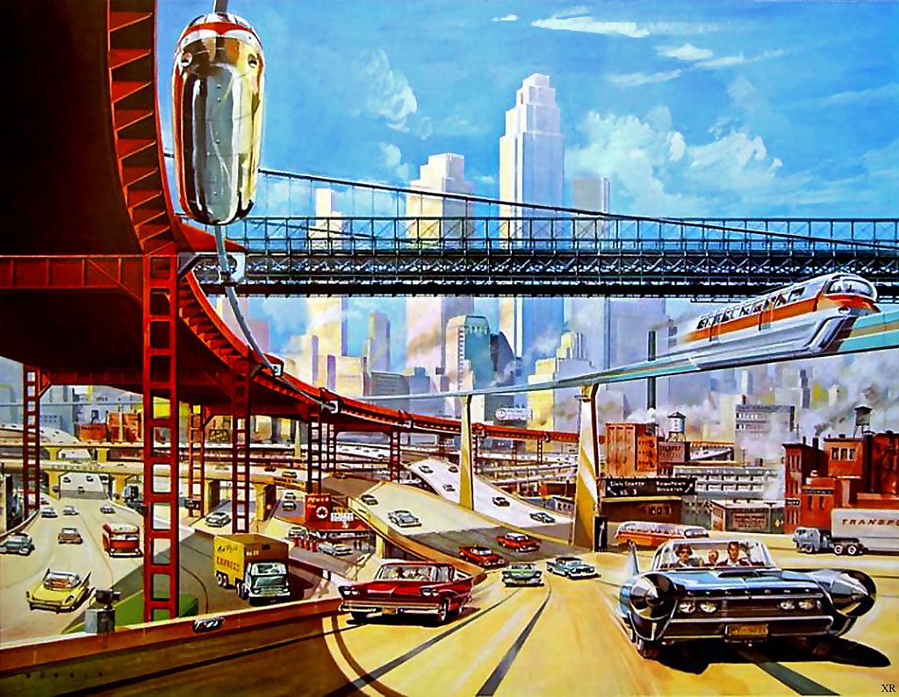

It was a great sales pitch. You need a personal car because it gives you freedom. No more waiting on bus stops in the wind. No more long walks home with shopping bags or cycling in the rain. You fully control where you go and when, comfortably sitting in your own little personal space, a carefully designed, mass-produced engineering masterpiece. You listen to your favorite music or talk to your loved ones along the way. Cars are quick and convenient. They were the future, and the future was bright. It was a great sales pitch because, like all good lies, it was mostly true.

The car utopia never happened outside cheesy TV commercials, however hard the world tried, and the reality turned out to look more like this:

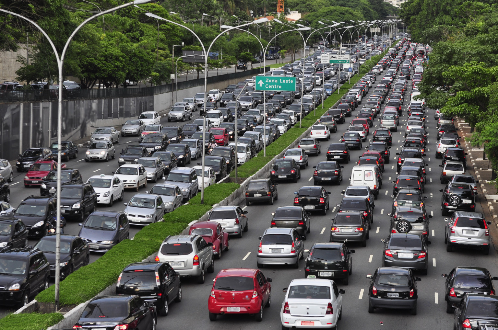

70 years ago, when a car only started becoming a commodity, it was impossible to see how much the dream distorts as its implementation scales up, and how much we will crave the right to live without a car.

## The car-centric dystopia

> We’ve designed car dependency into our cities quite deliberately, and car companies have influenced that. ... For as long as auto companies have existed, they have perpetuated one thing above all else: car dependency. 
> — [How automakers insidiously shaped our cities for cars](https://www.fastcompany.com/90781961/how-automakers-insidiously-shaped-our-cities-for-cars) by Elissaveta Brandon

<iframe width="560" height="315" src="https://www.youtube.com/embed/n94-_yE4IeU?si=DtbH3IcLIFmUFQkG" frameborder="0" referrerpolicy="strict-origin-when-cross-origin" allowfullscreen></iframe> 

_This beautiful promotion clip by General Motors illustrates the naïve american car-optimism of the time._

Once enough people have cars, you can sell them the idea of suburban paradise, allowing you to sell even more cars. The flywheel keeps accelerating. Longer commute, more cars, wider roads, bigger cars, repeat.

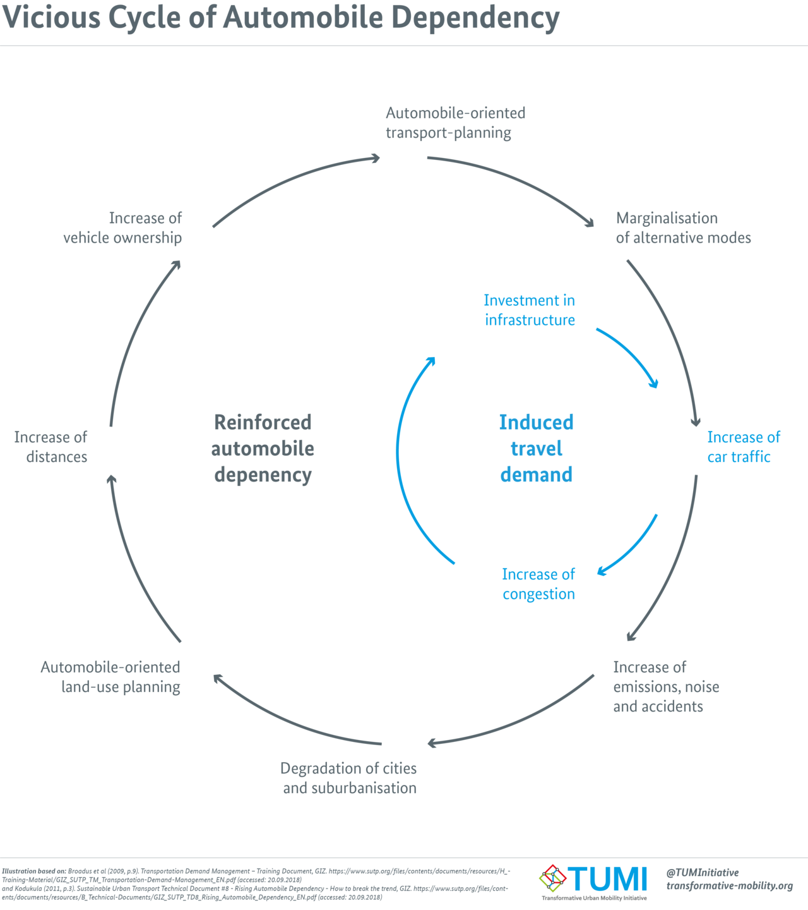

### People get fat

Driving increases risk of obesity, it's a scientific fact.

> Each additional hour spent in a car per day was associated with a 6% increase in the likelihood of obesity.  
> — [Obesity relationships with community design, physical activity, and time spent in cars](https://pubmed.ncbi.nlm.nih.gov/15261894/)
 
> * Over-reliance on private motor vehicles has likely contributed to the obesity epidemic.
> * Evidence for a positive association between motor vehicle driving and weight status exists. 
> * Small, widespread, reductions in driving could provide significant population health benefits. 
> — [Driving towards obesity](https://www.sciencedirect.com/science/article/abs/pii/S0091743514002023)

Obesity reduces mobility, tightening car dependence even stronger.

### People die

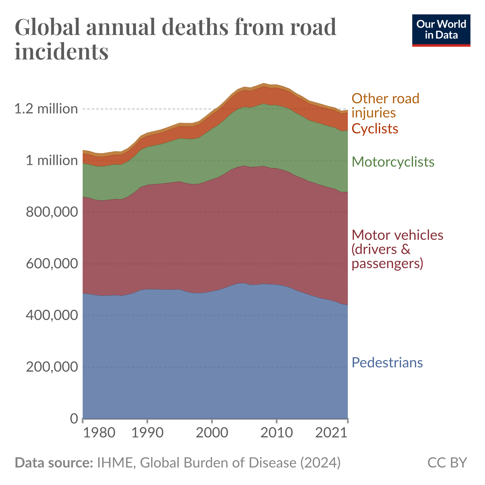

People [keep dying because of cars](https://ourworldindata.org/data-insights/more-than-a-million-people-die-from-road-injuries-every-year); half of them are pedestrians. To be safe from drivers, pedestrians start driving cars. Then, to be safe from other drivers, they buy bigger cars, and other road users buy even bigger cars until everyone around is driving Toyota Tundra.

<iframe width="560" height="315" src="https://www.youtube.com/embed/mQDegCqiVnU?si=uC_HnW30_C6m_FX4" title="YouTube video player" frameborder="0" allow="accelerometer; autoplay; clipboard-write; encrypted-media; gyroscope; picture-in-picture; web-share" referrerpolicy="strict-origin-when-cross-origin" allowfullscreen></iframe>

There might be specific, [policy-related reasons](https://www.vox.com/future-perfect/24139147/suvs-trucks-popularity-federal-policy-pollution) for American cars to get bigger, but [new car size is growing steadily](https://www.theguardian.com/business/2024/jan/22/cars-growing-wider-europe-report) in the UK and EU just as well.

### Cars pollute

More cars, bigger cars, more infrastructure. No wonder [the levels of pollution skyrocketed,](https://www.europarl.europa.eu/topics/en/article/20190313STO31218/co2-emissions-from-cars-facts-and-figures-infographics) with the transport sector being a [major contributor](https://ourworldindata.org/grapher/ghg-emissions-by-sector), led by personal cars.

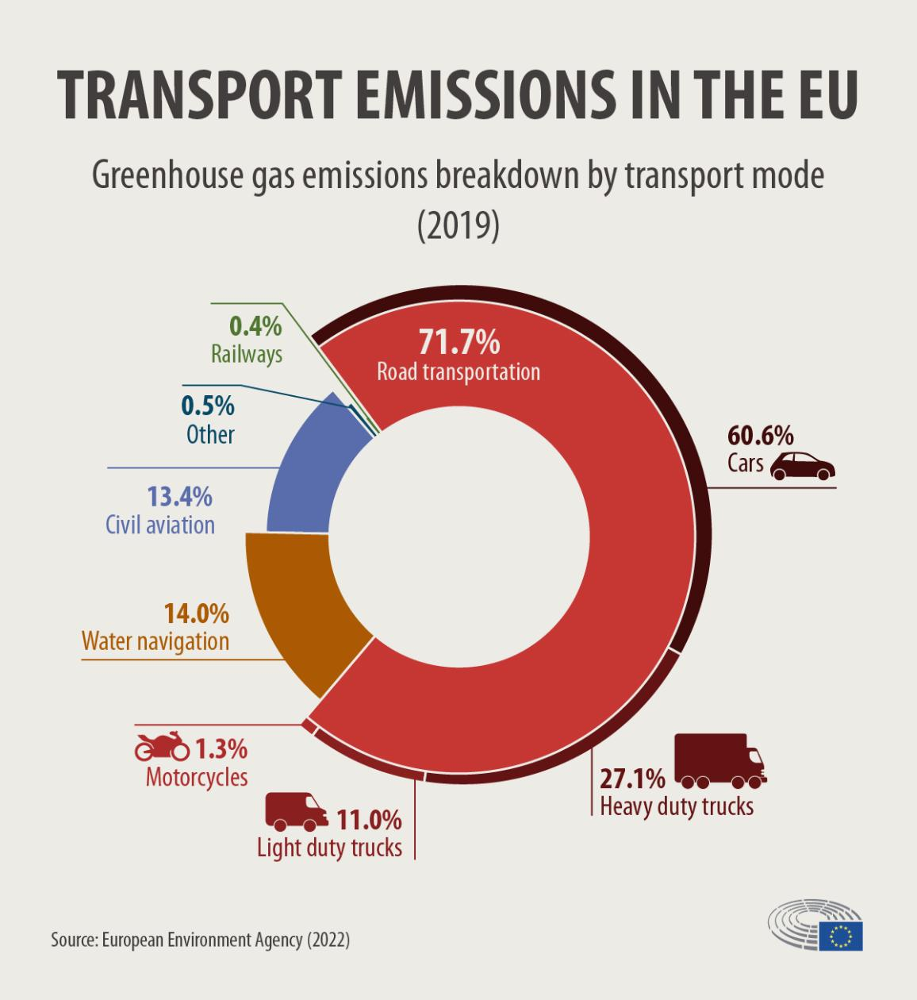

It turned out that cars, however convenient for use, make the world on a large scale [net worse for everyone](https://qz.com/375745/american-cities-are-designed-for-cars-which-makes-life-worse-for-everyone). They are loud, they take up space, they are dangerous and dirty, and our lives increasingly depend on them.

## The AI-centric dystopia

While AI is reportedly here to stay and the revolution is only getting started, the discourse of the financial establishment is predictably shifting from “[AI is totally not a bubble](https://www.businessinsider.com/david-solomon-ai-is-not-a-bubble-its-a-trend-2024-8?international=true&r=US&IR=T)” to “[Yes, AI is a bubble, and bubbles are good!](https://www.economist.com/finance-and-economics/2025/01/02/would-an-artificial-intelligence-bubble-be-so-bad)”.

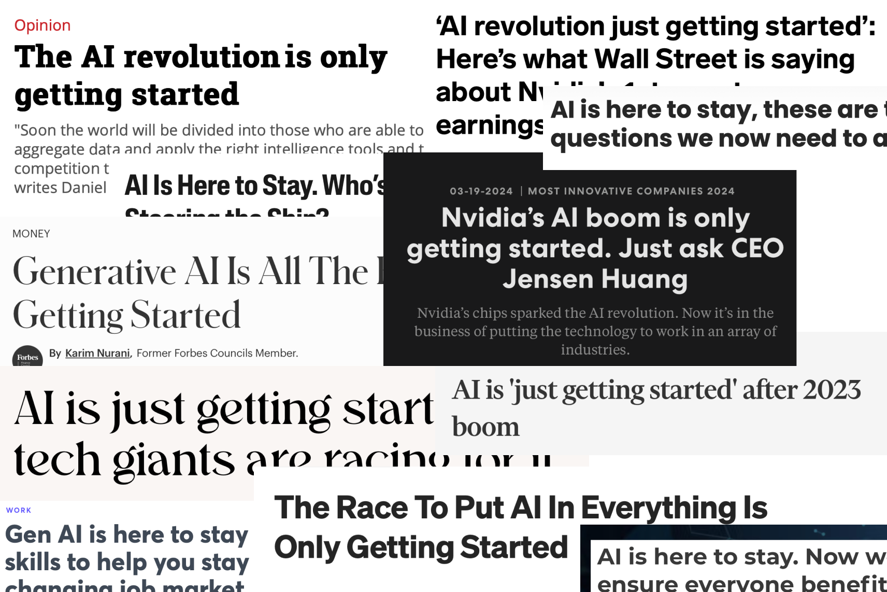

With every new piece of technology being hyped, its salesmen and marketers are trying to do the same thing. They are trying to build dependency. Make everyone not using it feel threatened. Make everyone not using it feel disabled. Make everyone not using it appear out of touch.

Even though “AI is only getting started,” its effects can be observed already.

### People get dumb

Critical thinking of AI tool users is already observably affected.

> Statistical analyses demonstrated a significant negative correlation between AI tool usage and critical thinking scores (r = -0.68, p < 0.001). Frequent AI users exhibited diminished ability to critically evaluate information and engage in reflective problem-solving.
> 
> Cognitive offloading was strongly correlated with AI tool usage (r = +0.72) and inversely related to critical thinking (r = -0.75). Mediation analysis revealed that cognitive offloading partially explains the negative relationship between AI reliance and critical thinking performance. 
> — [Increased AI use linked to eroding critical thinking skills](https://phys.org/news/2025-01-ai-linked-eroding-critical-skills.html)

Cognitive offloading is the intellectual equivalent of choosing driving over walking, and this effect is an intellectual equivalent of obesity.

> We observed that the use of GenAI tools shifts the knowledge workers’ perceived critical thinking effort in three ways. Specifically, for recall and comprehension, the focus shifts from information gathering to information verification. For application, the emphasis shifts from problem-solving to AI response integration. Lastly, for analysis, synthesis, and evaluation, effort shifts from task execution to task stewardship. 
> — [Lee et al. 2025](https://www.microsoft.com/en-us/research/wp-content/uploads/2025/01/lee_2025_ai_critical_thinking_survey.pdf)

### AI companies cause harm

LLM crawlers [have DDoSed](https://techcrunch.com/2025/01/10/how-openais-bot-crushed-this-seven-person-companys-web-site-like-a-ddos-attack/) many openly accessible web resources and [increased their bills](https://www.linkedin.com/posts/gergelyorosz_ai-crawlers-are-wrecking-the-open-internet-activity-7310948088838303762-BHBx). Free and open source software [is affected disproportionally](https://thelibre.news/foss-infrastructure-is-under-attack-by-ai-companies/): its openness makes it juicy sourcing material for models, and its creators have fewer resources to handle that load than commercial software. It means that the LLMs harm society as a whole more severely than any single person or a company, and I haven't even touched the questions of privacy and security and didn't use the term “probabilistic plagiarism.”

AI enables new sorts of harassment and manipulation techniques:
[Non-consensual deepfake porn](https://www.404media.co/deepfakes-harassment-youtube-instagram-ai-generated-explicit-videos/), voice [impersonation](https://www.newyorker.com/science/annals-of-artificial-intelligence/the-terrifying-ai-scam-that-uses-your-loved-ones-voice) scam, [political manipulation](https://carnegieendowment.org/research/2024/12/can-democracy-survive-the-disruptive-power-of-ai?lang=en). I know, AI is a tool, and any tool can be used maliciously, or, basically, the “[guns don't kill people](https://en.wikipedia.org/wiki/Guns_don%27t_kill_people,_people_kill_people)” argument, or “Cars don't kill people, bad drivers do.” Even if technically correct, irrelevant.

The guns' analogy is not far-fetched at all, by the way. Both [OpenAI](https://www.wired.com/story/openai-anduril-defense/) and [Anthropic](https://investors.palantir.com/news-details/2024/Anthropic-and-Palantir-Partner-to-Bring-Claude-AI-Models-to-AWS-for-U.S.-Government-Intelligence-and-Defense-Operations/) get military contracts, and the AI “arms race” is turning into a [very literal](https://www.popularmechanics.com/military/weapons/a64131751/ai-warfare/) arms race. UN secretary-general [has been calling](https://disarmament.unoda.org/the-convention-on-certain-conventional-weapons/background-on-laws-in-the-ccw/) for ban of autonomous lethal weapons since long before the current AI hype cycle, but it turns out that UN either does not care enough or can't do shit when powers that be fight for dominance.

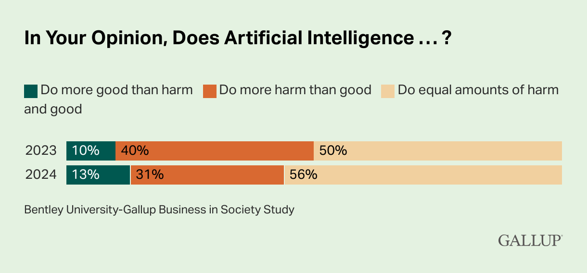

_[87% of respondents](https://news.gallup.com/poll/648953/americans-express-real-concerns-artificial-intelligence.aspx) do not consider AI net good._

### AI pollutes (figuratively)

AI pollutes our media landscape. Image search results are so overloaded with [AI-generated slop](https://futurism.com/google-ai-fake-spacecraft) that some advanced search engines caring for the users implemented an [explicit filter](https://help.kagi.com/kagi/features/exclude-ai-images.html) to remove them.

Bug bounty programs are [getting](https://sethmlarson.dev/slop-security-reports) [spammed](https://daniel.haxx.se/blog/2024/01/02/the-i-in-llm-stands-for-intelligence/) by random LLM-generated nonsense, which is increasingly cheap to produce and increasingly expensive to filter out.

This is part of the landscape now. You can't escape AI slop. [A quarter of published press releases](https://futurism.com/internet-polluted-ai-slop), 18% of financial consumer complaints, and 10% of job descriptions are AI-generated.

> — An AI-powered bot pretending to be a human, lamenting AI-powered bots who pretend to be human, to gain human trust, so that it can covertly market AI-illustrated books. 
> [A Reddit Bot Drove Me Insane](https://posthuman.blog/this-reddit-post-fried-my-brain/).

Even though readers, to put it mildly, [dislike](https://www.poynter.org/ethics-trust/2025/news-audience-feelings-artificial-intelligence-data/) AI-generated content, major news sources increasingly rely on it. Not only click farms like [Quartz](https://futurism.com/quartz-fires-writers-ai-slop) and [DeadSpin](https://variety.com/2024/digital/news/deadspin-staff-laid-off-site-sold-1235938325/), but also credible outlets like [the New York Times](https://www.semafor.com/article/02/16/2025/new-york-times-goes-all-in-on-internal-ai-tools) and [LA Times.](https://futurism.com/la-times-ai-kkk)

_AI faker interviewing to Vidoc, image taken from [Pragmatic Engineer](https://newsletter.pragmaticengineer.com/p/ai-fakers)_

AI fakers cheating tech interviews is also a part of reality now. There are countless tools that are specifically marketed as interview assistants, which I'm not going to promote. Fortunately, today's models are not fast and smart enough to go unnoticed, but extrapolating from now, we'll get there very soon. Terrifying waste of human lives, time, money, and energy.

### AI pollutes (literally)

Speaking of waste. Data centers running AI models are huge.

> The production of a single 2 kg computer requires the extraction of a staggering 800 kg of raw materials. 
> — [Digital Economy Report 2024](https://unctad.org/system/files/official-document/der2024_en.pdf) by UN

They require resources not only to build, but also to run.

> ...in the tech hub of Ireland, the rise of AI could see data centres account for nearly 35 per cent of the country’s energy use by 2026. 
> — [AI has an environmental problem. Here’s what the world can do about that.](https://www.unep.org/news-and-stories/story/ai-has-environmental-problem-heres-what-world-can-do-about), UNEP

This is not exactly new: internet advertising has been burning some coal for quite a while already, but the scale of the problem is another level.

> A request made through ChatGPT, an AI-based virtual assistant, consumes 10 times the electricity of a Google Search, reported the International Energy Agency.
> — [Same report](https://www.unep.org/news-and-stories/story/ai-has-environmental-problem-heres-what-world-can-do-about), UNEP

Increased energy demand is so high that the existing infrastructure can't handle that. [Microsoft has reopened](https://www.npr.org/2024/09/20/nx-s1-5120581/three-mile-island-nuclear-power-plant-microsoft-ai) a stopped nuclear reactor to power its AI cloud.

GPUs and models become more energy-effective quickly, but paradoxically, increased effectiveness increases resource consumption. This effect even has a name, [Jevons Paradox](https://www.npr.org/sections/planet-money/2025/02/04/g-s1-46018/ai-deepseek-economics-jevons-paradox). Metaphorically speaking, [the invention of kerosene did not save the sperm whale](https://edconway.substack.com/p/no-kerosene-did-not-save-the-sperm).

> For example, scholars have found evidence of a [Jevons paradox in water markets](https://www.sciencedirect.com/science/article/abs/pii/S0378377419314751), where, for example, greater efficiency in irrigation leads to greater overall water consumption. Others have found evidence of a [Jevons paradox for infrastructure](https://cityobservatory.org/the-fundamental-global-law-of-road-congestion/?utm_source=npr_newsletter&utm_medium=email&utm_content=20250201&utm_term=9963392&utm_campaign=money&utm_id=650011&orgid=447&utm_att1=), where, for example, more highway lanes end up creating more traffic congestion.

AI is not the first and not the last technology shaping the world around us. Neither it is the most transformative or groundbreaking in history—it is not [indoor plumbing](https://freddiedeboer.substack.com/p/the-shitting-in-the-yard-test), after all. However crazy it might sound, [AI is a normal technology](https://knightcolumbia.org/content/ai-as-normal-technology), and as with any other potentially transformative technology before or after, we better make sure it transforms the world for the better, not worse.

## Resist the dystopia

I'm lucky to be living in Amsterdam, where locals refused to accept car-centric city design over half a century ago. It was not an easy fight, and [it could have gone very differently](https://brilliantmaps.com/amsterdam-2000/). The plan for the city was to turn Amsterdam into a network of highway-connected skyscrapers, because the city of the future was _obviously_ supposed to be such, and suggesting otherwise was an _obvious_ act of backwards thinking.

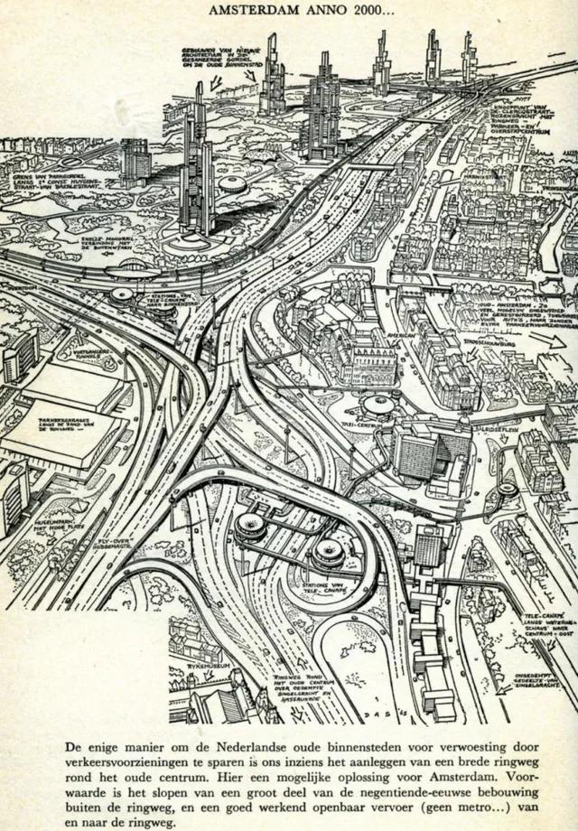

### Resistance is useful

The protesters might have looked for outsiders like neo-Luddites or tree huggers at the time, and some of them probably were, but from 2025 their righteousness is so clear that I don't even want to elaborate. I'll just mention that they produced some [lovely posters](https://www.theguardian.com/cities/gallery/2019/jun/25/kick-car-out-city-amsterdam-cycle-protest-posters-in-pictures) and destroyed some property along the way.

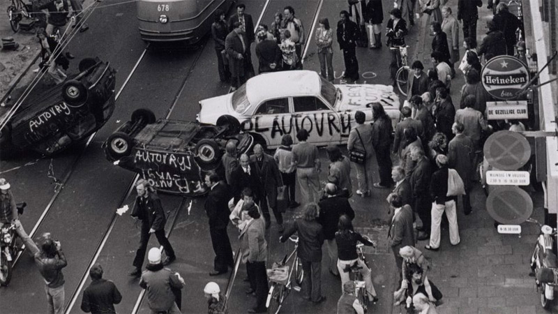

Other countries ([including the USA](https://www.bloomberg.com/news/articles/2019-10-08/the-hidden-history-of-american-anti-car-protests)) had anti-car movements of their own, but few were as successful.

<iframe width="560" height="315" src="https://www.youtube.com/embed/YY6PQAI4TZE?si=gF2NtoFi42hQSoXk" title="YouTube video player" frameborder="0" allow="accelerometer; autoplay; clipboard-write; encrypted-media; gyroscope; picture-in-picture; web-share" referrerpolicy="strict-origin-when-cross-origin" allowfullscreen></iframe>

They dared to call bullshit on the sales pitch. They had the courage to resist a disruptive transformation when the whole universe suggested every city to go all-in.

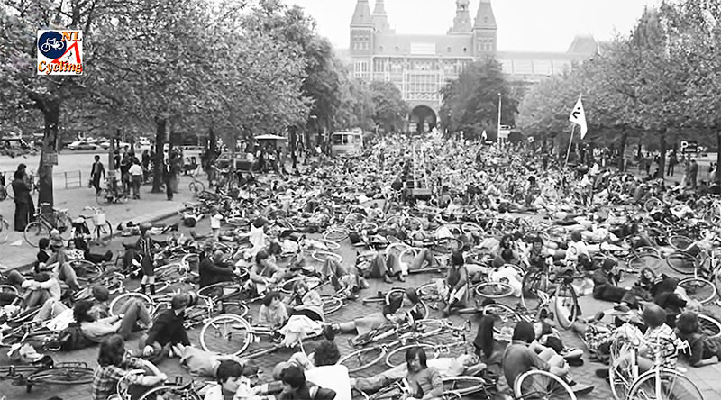

### It is not too late

Even an implemented car-centric design is [not impossible](https://bicycledutch.wordpress.com/2025/03/05/a-rare-glimpse-of-utrecht-in-1993-a-before-and-after/) to revert. Paris, Utrecht, or even Seattle are good examples.

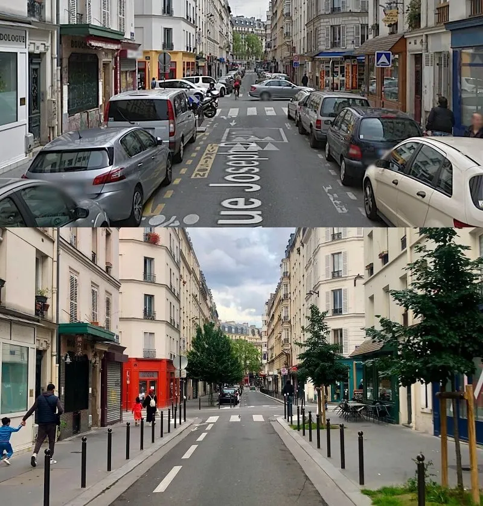

_Paris is becoming walkable again_

But it is a long, hard, and expensive process, which is exactly the goal of technology marketers: build the technology in into every aspect of your life and remove all possible alternatives. [“Chokepoint Capitalism”](https://time.com/6219423/chokepoint-capitalism-doctorow-giblin/) at work.

We can revert only so much. We will never revert the death toll imposed by cars. Neither can we revert carbon dioxide they exhausted or megatons of oil pumped and burned. We will never get back the money and raw materials spent on building roads, parking lots, or the cars themselves. We need to make sure we don't regret the sacrifice we make.

### What we should fight for

I don't think we should or even can resist AI or any other modern technology per se. It is about as silly as resisting electricity or an internal combustion engine. Neither do I think that any technology necessarily has to go full cycle from a breakthrough to a burden, as Maksim Izmaylov suggested in [Eco Cycles](https://maksimizmaylov.com/writing/eco-cycles/). But we totally should fight for the right to live, think, and create without any new trending technology, including AI. We should fight for [AI safety](https://www.europarl.europa.eu/topics/en/article/20230601STO93804/eu-ai-act-first-regulation-on-artificial-intelligence), for control over our data, for improved [energy effectiveness](https://savethe.ai/electricity/). We should fight against AI being imposed on us as the default mode of human-computer interaction. We should fight to ban AI-powered weapons worldwide. We should demand climate action from AI profiteers. We should demand from AI crawlers to respect copyright and [robots.txt](https://blog.cloudflare.com/ai-audit-enforcing-robots-txt/).

We should fight, above all, for AI to be non-destructive to our lives. Disruptive solutions are usually lazy. They are often a sign that creators didn't put enough effort into making them harmonious with the good things we already have. Also, we should try to not unlearn to reason and make decisions ourselves, and it might be hard when the alternative is so accessible.

Just as with anti-car protests, the goal shouldn't be as blunt as “ban cars.” It is just not going to happen, because you can't go back in time, and I doubt you really want. The realistic goal can be to “have good cycle paths and walkways and make new and existing cars safe for everyone.” I don't think you should [boycott AI](https://unherd.com/2025/03/why-im-boycotting-ai/) or demand to [pause AI research](https://time.com/6977680/ai-protests-international/), but I'm glad that these voices are loud enough so that my position does not look radical at all. I think Noam Chomsky was wrong in claiming that AI [will degrade our science and debase our ethics by incorporating into our technology a fundamentally flawed conception of language and knowledge](https://www.nytimes.com/2023/03/08/opinion/noam-chomsky-chatgpt-ai.html), or, rather, I hope he was wrong. I still do believe we can have both human dignity and great new things like [AlphaFold](https://alphafold.ebi.ac.uk), just like we have both cozy walkable cities and superhighways, but I know it won't be an easy way.
