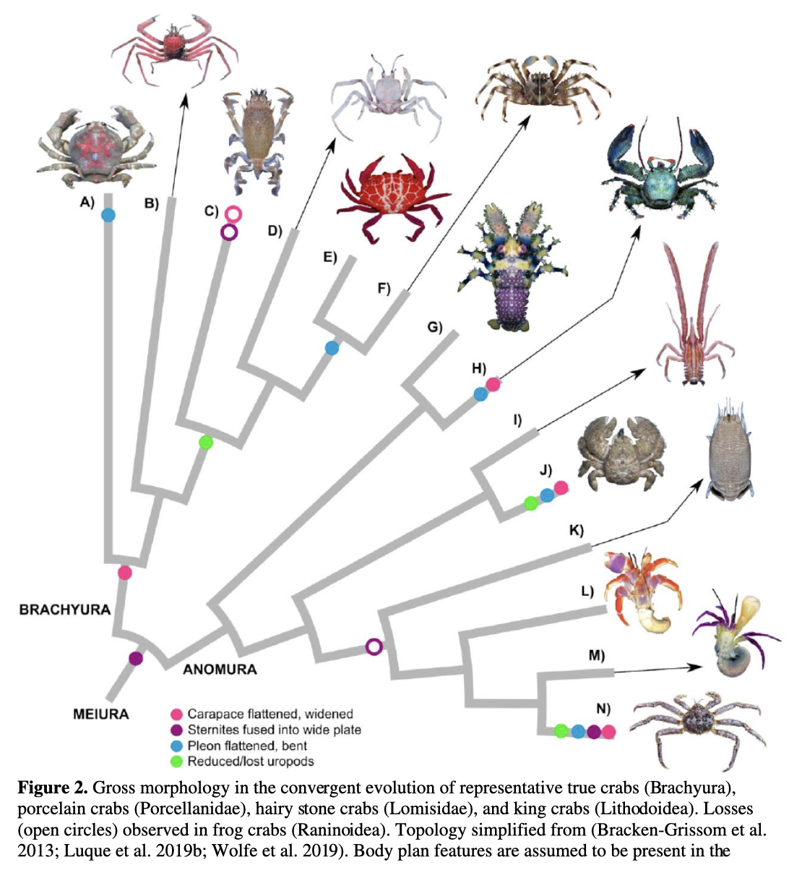

The evolution created a crab out of a non-crab at least five independent times. It happens so consistently that they had to invent [the word for it](https://en.wikipedia.org/wiki/Carcinisation).

_
Source: Joanna M Wolfe et al. [How to Become a Crab: Phenotypic Constraints on a Recurring Body Plan](https://www.researchgate.net/publication/347928262_How_to_Become_a_Crab_Phenotypic_Constraints_on_a_Recurring_Body_Plan), licensed as CC BY 4.0_

Internet services evolve faster, and the same mechanics of convergent evolution are steadily turning every content platform oyt there into an infinite feed of short hyperstimulating videos. [Spotify](https://www.theverge.com/2023/3/8/23630821/spotify-design-home-music-podcasts-audiobooks-app), [Instagram](https://www.vice.com/en/article/instagram-tiktok-video-meta/), [Facebook](https://www.cbc.ca/news/business/tiktok-instagram-1.6534633) and [YouTube](https://techcrunch.com/2024/10/03/youtube-takes-on-tiktok-with-longer-shorts-templates-trends-and-more/) look increasingly more like TikTok. Your messenger, your newsreader, and the fancy neobank app are getting Instagram-like stories, which is still a step behind Reels, but they seem to be on the same track. They optimize for the same metrics using exactly the same set of tools, driven by the same goal. They are competing for the same resources in the same ecosystem. No wonder, [they end up developing the same set of features](/blog/you-resist/).

On a parallel track, b2b services converge into cargo cult of each other. Miro gets [video calls](https://help.miro.com/hc/en-us/articles/21992143796754-Video-calls-BETA) and [UI prototyping](https://miro.com/prototyping/), while Apple [makes Freeform](https://www.apple.com/newsroom/2022/12/apple-launches-freeform-a-powerful-new-app-designed-for-creative-collaboration/). Figma gets FigJam while Slack gets [Canvas](https://slack.com/intl/en-gb/features/canvas) and [Huddles](https://slack.com/intl/en-gb/features/huddles), [every](https://slack.com/intl/en-gb/features/ai) [one](https://miro.com/ai/) [of](https://www.notion.com/help/guides/category/ai) [them](https://www.figma.com/ai/) having AI summarizers and third-party integrations with the same services. They converge into kits of poorly integrated bells and whistles, resembling one another, like a lookalike contest where participants don't know who they were supposed to impersonate but believe that others do.

It might be fun or sad to watch, but crustaceans evolve into crabs not because it's any good for the fish, you know what I mean?