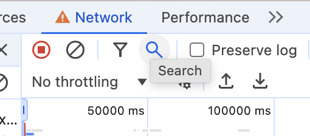
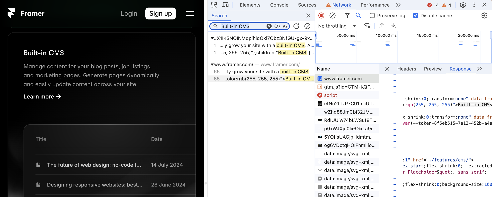
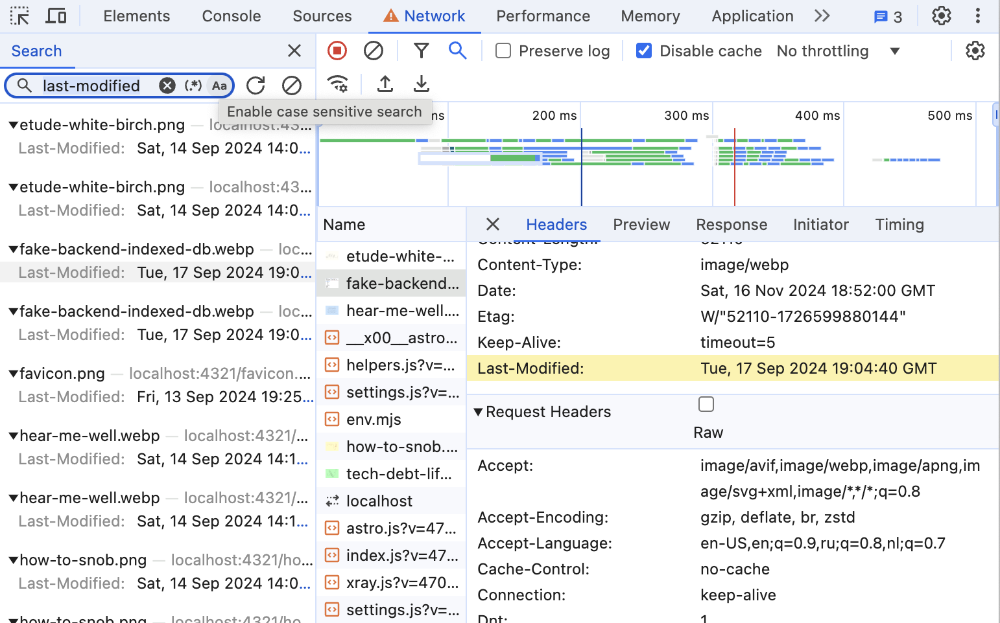
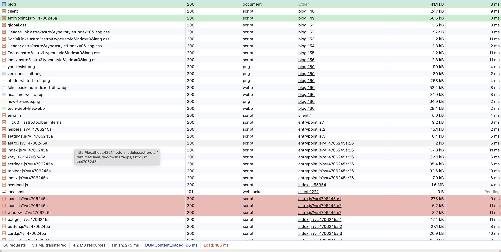
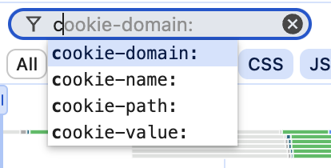
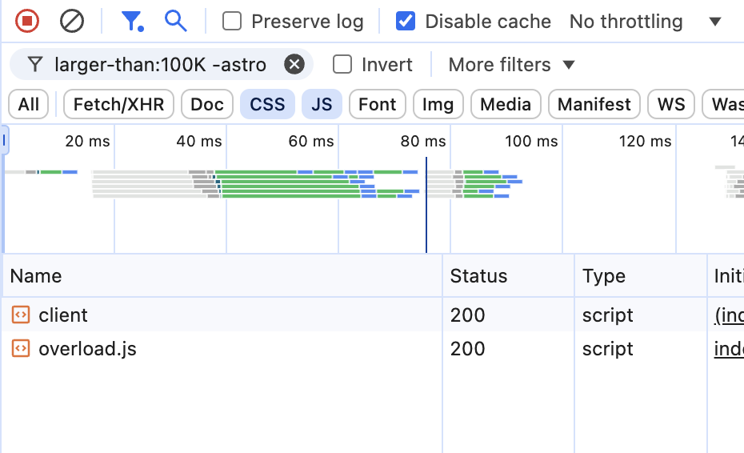
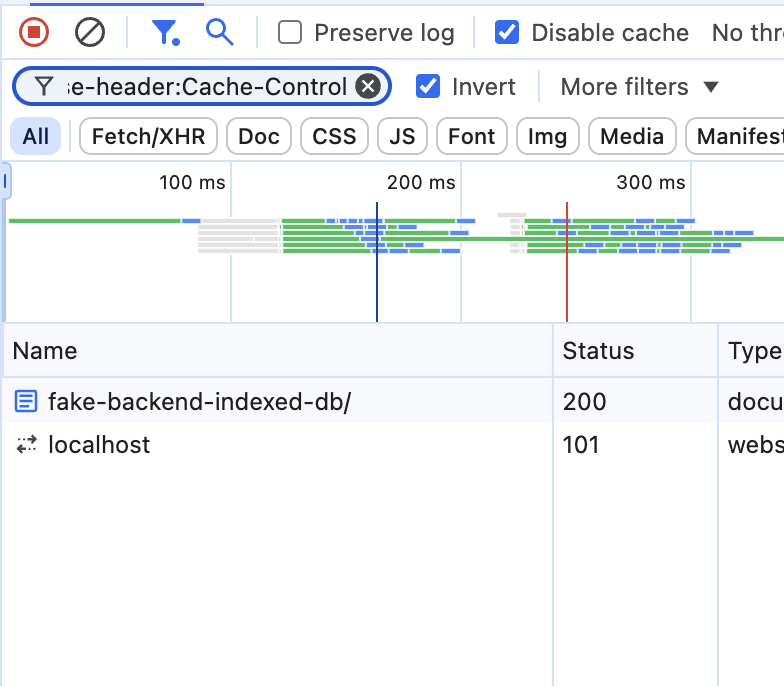
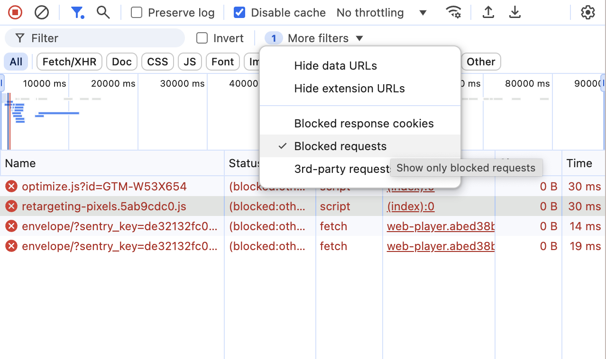

I've just discovered full-text search in Network tab. It hadn't occurred to me in the previous 10 years, though I was sitting with devtools open in front of me for several hours a day, five days a week, and the button was there the whole time. It feels like that time I was running around the house for an hour looking for my keys only to find they were already in my hand. This embarrassment happens regularly to me, so I am not too surprised. But it got me wondering what I might know in the Network tab that I am aware of, that others might be not.

This time, we'll talk about:

- Full-text search
- Initiator
- Filtering resources

## Full-text search

This is the button that I failed to notice for many years. Right here, between "Filter" and "Preserve log" that I used extensively.

Type some text you see on the page into the search bar, hit Enter and see all network resources containing this text. It is useful debugging a complex project with content coming from different APIs or with modules in different repositories, and you want to know where to look for the source code.

Apparently, in our case, it comes in both HTML file contents and JS file, which is a common pattern in server-side generated pages: full-page HTML is getting loaded, and then "hydrated" with JavaScript that is capable of generating exactly the same page, to enable smooth SPA-style interactions. In a different case, we could just as well have found an XHR request or a static resource.

### Search in HTTP headers

This search works not only across response bodies, but across HTTP headers too. Also, it supports regular expressions and case-sensitive search. Handy thing.

## Initiator 

For every network resource, initiator data is logged. Click on a request you're interested in, and open the Initiator tab 

It shows not only the file, line and column from where the request is initiated, but the whole stack trace. Leads you to the code listing on the Sources tab. Works best with sourcemaps or plain old non-minified js.

### Preview transitive initiators in the list

Hold Shift key and hover over a resource in the list. It will highlight red resources that were requested from the hovered resource, and highlight green resource that initiated loading of the one you hover.

Note that it also highlights transitive initiators recursively, meaning that it highlights green the resource that triggered loading of the hovered resource, the resource that loaded that resource, and so on. Same goes the other direction, but in red.

## Filter resources

In the top bar, where you filter resources by type: XHR, CSS, JS, etc., you can select several types simultaneously by holding Cmd/Ctrl 

### Querying 

Right above the resource type filters, is the querying text field. It supports regexps. I don't like regular expressions, and, if I'm being completely honest, don't understand them. But if you do, then, sure, go ahead and shine, you, mister clever.

By adding a `-` before a word, you filter out resources matching the word. Also, you can use special property names and they even have a basic intellisense:

To put it all together, this is how you filter CSS and JS files larger than 100kb _not_ having the word "astro" in URL:

`domain:framer.com`, `mime-type:application/json`, `method:put` and `has-response-header:X-Frame-Options` are all valid requests. For the full list of query params you can refer to [Chrome for developers](https://developer.chrome.com/docs/devtools/network/reference#filter-by-property). If you'd read it full, this post wouldn't be needed, but it's so comprehensive and boring that I believe you won't, and this post still makes sense.  

### Invert filter

Shows only requests that are filtered out by current query. For example, type `has-response-header:Cache-Control` in the query field and enable the "Invert filter" option, and you'll get only resources that have no `Cache-Control` header.

### Show only blocked requests

Shows only resources that are blocked by extensions and by "Block request URL". Useful to find that one little shit mistakenly blocked by AdBlock and breaking your app.

There's more to learn

- Filtering by timeline
- Screenshots aka filmstrip
- Preserve log and pause recording
- Export/import
- Network throttling
- Blocking of request
- Custom user agent
- Override content
- Replay XHR

But for some other time.
