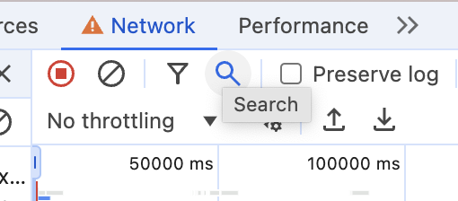
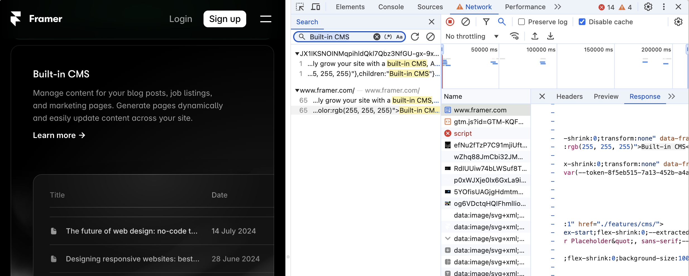
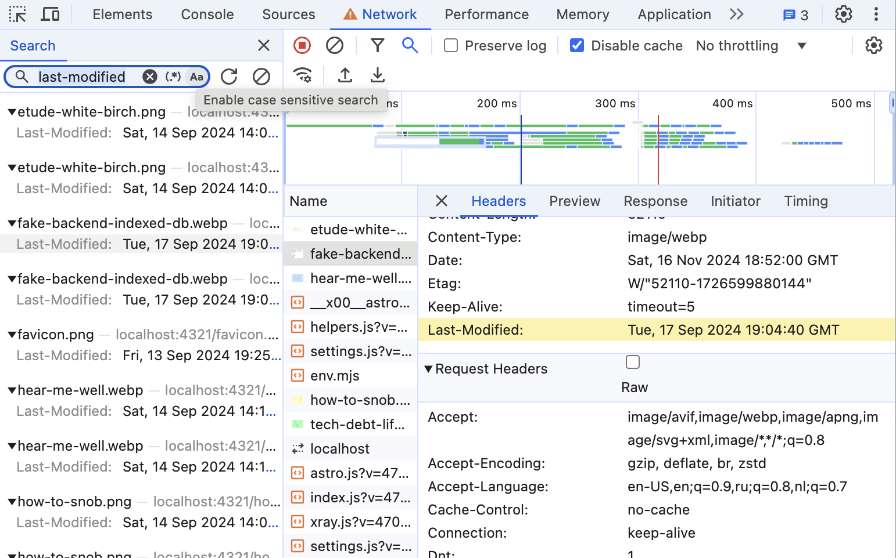

I've just discovered full-text search in the Network tab. It hadn't occurred to me in the previous 10 years, though I was sitting with devtools open in front of me for several hours a day, five days a week, and the button was there the whole time. It reminds me of a time when I spent an hour searching around the house for my keys, only to discover they were already in my hand. This embarrassment happens regularly to me, so I am not too surprised. But it got me wondering what else I might be aware of that others might not.

## Full-text search

This is the button that I failed to notice for many years. Right here, between "Filter" and "Preserve log," that I used extensively.

Type some text you see on the page into the search bar, hit Enter, and see all network resources containing this text. It is useful for debugging a complex project where content comes from different APIs and modules are spread across repositories, and you want to know where to find the source.

Apparently, in our case, it comes in both HTML file contents and JS file, which is a common pattern in server-side-generated pages: full-page HTML is getting loaded and then "hydrated" with JavaScript that is capable of generating exactly the same page to enable smooth SPA-style interactions. In a different case, we could just as well have found an XHR request or a static resource.

### Search in HTTP headers

This search works not only across response bodies but across HTTP headers too. Also, it supports regular expressions and case-sensitive search. Handy thing.

