Этот мир просто охренеть какой сложный, каждый день поражаюсь.Чтобы хоть как-то его познавать и при этом не съехать с катушек, нам, людишкам, с нашими жалкими мозгами приходится задумчиво смотреть на происходящее, анализировать увиденное и строить модели — абстракции, с помощью которых мы с некоторой точностью кое-что иногда можем предсказывать и даже наивно полагать, что понимаем, что же на самом деле происходит. И знаете, что удивительно? Этот подход замечательно работает. Ну, почти всегда. По крайней мере, ничего лучше мы до сих пор не придумали.Но вообще-то я не об этом. Я хочу рассказать об одной чрезвычайно интересной как с эстетической, так и с математической точки зрения категории этих самых моделей.

Да, я о клеточных автоматах, а именно — об их подмножестве, простейших клеточных автоматах (Elementary cellular automaton). В этой статье я поведаю, что это такое, какие они бывают, какими свойствами обладают, а также отвечу на главный, на мой взгляд, и совершенно правильный вопрос, который часто несправедливо игнорируется в подобных статьях. Звучит он так: _А это всё вообще зачем?_

Забегая вперед, скажу, что простейшие клеточные автоматы используются в криптографии, моделировании физических процессов, поведения людей, в биологии, и в целой куче других важных и интересных штук. И вообще: _во-первых, это красиво_.

Я искренне надеюсь, что после прочтения статьи вы сами захотите поиграться с ними, и на этот случай у меня припасен собранный из JS и палок [генератор](http://oshibka404.github.io/eca).

## Унылая теория

### Что такое клеточный автомат

Дискретная модель, представляющая собой сетку произвольной размерности, каждая клетка которой в каждый момент времени может принимать одно из конечного множества состояний, и определено правило перехода клеток из одного состояния в другое.

Примеры: [«Жизнь» Конуэя](https://ru.wikipedia.org/wiki/%D0%96%D0%B8%D0%B7%D0%BD%D1%8C_(%D0%B8%D0%B3%D1%80%D0%B0)), [Автомат Фон Неймана](https://ru.wikipedia.org/wiki/%D0%90%D0%B2%D1%82%D0%BE%D0%BC%D0%B0%D1%82_%D1%84%D0%BE%D0%BD_%D0%9D%D0%B5%D0%B9%D0%BC%D0%B0%D0%BD%D0%B0), [Wireworld](https://ru.wikipedia.org/wiki/Wireworld), [Модель сегрегации Шеллинга](http://www.zachernuk.com/2012/10/03/fun-with-schelling-segregation-with-source/).

### Какие они бывают?

**В зависимости от размерности решетки:**   
одно-, дву-, трёхмерные, и т.д.  
Например, [Правило 110](https://en.wikipedia.org/wiki/Rule_110) и другие, освещенные в этой статье, — одномерные, «Жизнь» — двумерная.  
  
**В зависимости от количества возможных состояний:**   
бинарные, троичные, и т.д.  
  
В разных клеточных автоматах может по-разному определяться **окрестность клетки**, то есть, множество клеток, от которых будет зависеть состояние в следующий момент времени. Это может быть, например, [окрестность Фон Неймана](https://ru.wikipedia.org/wiki/%D0%9E%D0%BA%D1%80%D0%B5%D1%81%D1%82%D0%BD%D0%BE%D1%81%D1%82%D1%8C_%D1%84%D0%BE%D0%BD_%D0%9D%D0%B5%D0%B9%D0%BC%D0%B0%D0%BD%D0%B0) различных рангов или [окрестность Мура](https://ru.wikipedia.org/wiki/%D0%9E%D0%BA%D1%80%D0%B5%D1%81%D1%82%D0%BD%D0%BE%D1%81%D1%82%D1%8C_%D0%9C%D1%83%D1%80%D0%B0).  
  
Клеточные автоматы бывают синхронные и [асинхронные](http://www.kanadas.com/CA/AsyncCA/AsyncCA-ALife.Summary.pdf). В синхронных все клетки системы обновляются одновременно, в асинхронных — каждая делает это независимо.  
  
Одна из самых важных классификаций — **по типам поведения**. Об этом я расскажу отдельно чуть ниже.

### А что же тогда такое простейший клеточный автомат?

Одномерный бинарный (с двумя возможными состояниями) клеточный автомат, где состояние клетки в каждый момент времени зависит только от её собственного состояния и состояний смежных с ней клеток в предыдущий момент времени.

Простейших клеточных автоматов существует всего 256, и поведение некоторых из них дублирует другие. Но, несмотря на это, широко известный в узких кругах [Стивен Вольфрам](https://ru.wikipedia.org/wiki/%D0%92%D0%BE%D0%BB%D1%8C%D1%84%D1%80%D0%B0%D0%BC,_%D0%A1%D1%82%D0%B8%D0%B2%D0%B5%D0%BD) посвятил годы жизни их изучению, до него этим также занимались десятки математиков, да и по сей день ученые пишут диссертации и научные труды на эту тему.

Для начала определимся с терминологией. Так как вариантов таких автоматов всего 256, тот самый Вольфрам (я часто буду на него ссылаться) не стал сильно заморачиваться и предложил называть их числами от 0 до 255. Это именование по причине своей лаконичности и удобства отлично прижилось, и с тех пор оно называется, вы не поверите, "[Код Вольфрама](https://en.wikipedia.org/wiki/Wolfram_code)".

Я вас понимаю, мне тоже лень ходить по ссылкам, поэтому я коротко расскажу о том, как эти коды понимать.

### Что означают коды Вольфрама

Рассмотрим сразу на примере. Возьмём номер правила, например, 110.

1. 11010 = 011011102  
2. Впишем цифры двоичного представления числа в таблицу:

|111|110|101|100|011|010|001|000|
|---|---|---|---|---|---|---|---|
|0|1|1|0|1|1|1|0|

В зависимости от состояний соседа слева, самой клетки и соседа справа (первая строка таблицы) на следующем шаге клетка примет одно из состояний, указанных во второй строке.

Еще более наглядно это можно представить так:

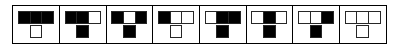

Таблица состояний правила 110

Также Вольфрам предложил разделить клеточные автоматы на четыре класса по типу поведения:

**1 класс:** все клетки быстро принимают одинаковое состояние, которое становится стабильным.  
Например, правило 40:

Правило 40

**2 класс:** состояние всех клеток быстро стабилизируется, либо возникают периодические колебания.  
Например, правила 3 и 33:

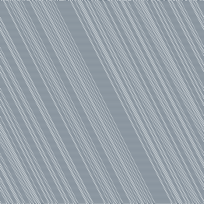

Правило 3

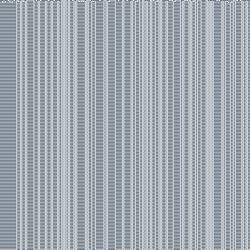

Правило 33

**3 класс:** автомат порождает хаотические, непериодические структуры. Небольшие изменения исходного состояния влекут значительные изменения в результате.  
Например, правило 22:

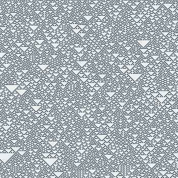

Правило 22

**4 класс:** автомат порождает сложные, взаимодействующие между собой структуры, способные выживать длительное время, однако не достигает стабильности.  
Например, правило 193:

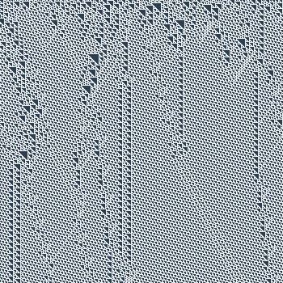

Правило 193

## Простейшие клеточные автоматы в жизни

### Правило 30

Иногда элементарные клеточные автоматы обнаруживаются в совершенно неожиданных местах.

Вот, например, посмотрите, какой милашка:

Текстильный конус

Только не обольщайтесь. Он вас не любит. Это — [Текстильный конус](https://en.wikipedia.org/wiki/Conus_textile), самый опасный для человека моллюск из семейства Конусы. Противоядия от его яда пока нет.

Рисунок на его раковине — не что иное как узор, порожденный «Правилом 30». По крайней мере, именно так [считают](https://www.maths.nottingham.ac.uk/personal/sc/pdfs/Seashells09.pdf) в Ноттингемском университете.

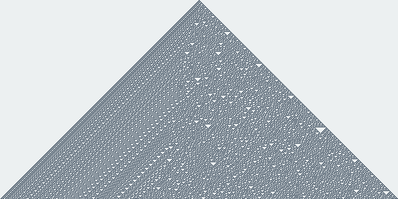

Правило 30. Исходное состояние — жива одна клетка в середине

То же самое Правило 30 до недавнего времени [использовалось](http://reference.wolfram.com/language/tutorial/RandomNumberGeneration.html#830168163) в пакете Mathematica для генерации псевдослучайных чисел. Это стало возможным благодаря важному его свойству: порождаемые им результаты хаотичны, то есть, незначительное изменение в начальных условиях оказывает значительное влияние на порождаемые результаты.

Однако, существует [огромное множество](http://www.iwriteiam.nl/Rule30.html) начальных условий, при которых правило порождает повторяющиеся паттерны. Например, если в начальных условиях «жива» каждая 14-я клетка, в результате получается вот такой скандинавский свитер.

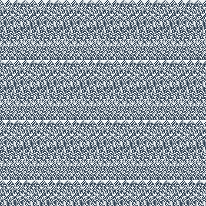

Правило 30. Исходное состояние — жива каждая 14-я клетка

### Правило 110

Одно из самых интересных правил. Вольфрам относит его к классу 4, но в зависимости от начальных условий оно может вести себя как представитель класса 1, 2, 3 или 4.

Для сравнения, эволюция из одной точки:

Правило 110. Исходное состояние — жива одна клетка в середине

Налицо периодические структуры у левой границы треугольника, стабильное гомогенное состояние в правой половине, и хаотические структуры, перемежающиеся нестабильными периодическими, в центральной и правой частях треугольника.

А вот — эволюция из случайного начального состояния, заполненного живыми клетками на 50%.

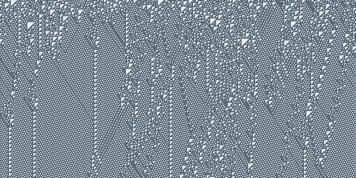

Правило 110. Исходное состояние — случайная последовательность живых и мёртвых клеток

Тут также видны и периодические (что интересно, с разными периодами), и хаотические. В 2000 году Мэтью Кук [доказал](http://www.complex-systems.com/pdf/15-1-1.pdf), что этот клеточный автомат является Тьюринг-полным, то есть, на его основе можно реализовать любую вычислимую функцию.

### Фракталы

Есть целый ряд клеточных автоматов (правила 18, 22, 126, 161, 182, 218, etc.), которые, развиваясь из одной точки, порождают фрактальные изображения. Например, рисунок правила 22 — это треугольник Паскаля по модулю 2 (эдакий дискретный аналог «Салфетки Серпинского»). Связь салфетки Серпинского и треугольника Паскаля уже достойно [освещалась](https://habrahabr.ru/post/167817/) на Хабре три года назад.

А выглядит всё это так:

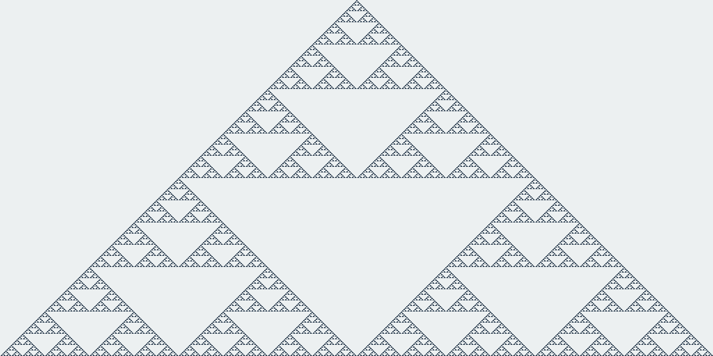

Правило 22. Исходное состояние — одна живая клетка в середине

Правило 161 порождает инвертированный вариант того же самого фрактала.

Правило 161. Исходное состояние — одна живая клетка в середине

Кстати, забыл упомянуть один **важный момент**, касающийся реализации автоматов. 

> Для того, чтобы избежать «краевого эффекта», то есть, влияния границ на пограничные клетки, нужно замкнуть автомат в кольцо, т.е. сделать крайнюю левую клетку правым соседом крайней правой, и наоборот.

Иначе вместо вполне ожидаемого полностью закрашенного прямоугольника (эволюция правила 161 с начальным состоянием, полностью состоящим из живых клеток) можно увидеть кое-то неожиданное:

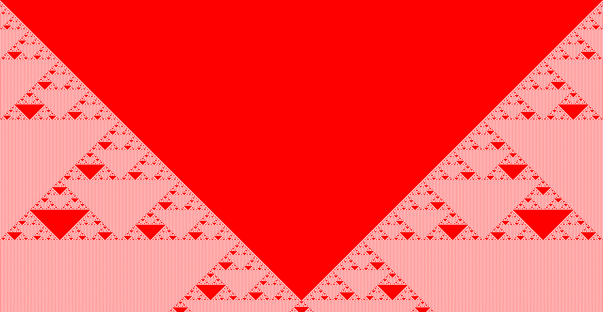

Правило 161. Исходное состояние — все клетки живы. Края автомата не закольцованы

### Правило 184

Правило 184 обладает несколькими интересными особенностями, благодаря которым оно широко применяется в математическом моделировании:

- После каждого шага количество «живых» клеток остается неизменным
- Правило в зависимости от исходного состояния может вести себя как правило класса 2 или 4.
- Чем меньше «живых» клеток в исходном состоянии, тем быстрее автомат стабилизируется

С его помощью довольно эффективно моделируются [транспортные потоки](https://en.wikipedia.org/wiki/Microscopic_traffic_flow_model#Cellular_automaton_models). 

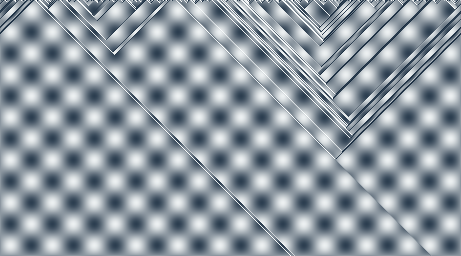

Правило 184. Исходное состояние — случайная последовательность живых и мёртвых клеток

Каждый отдельно взятый автомобиль передвигается вперед, в то время как [волна траффика](https://en.wikipedia.org/wiki/Traffic_wave) движется назад.

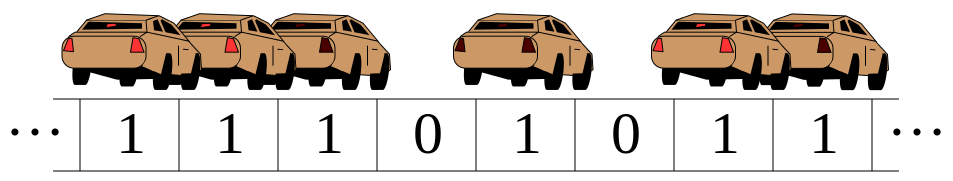

Иллюстрация модели потока траффика. Картинка с Википедии.

Также оно [применимо](http://link.springer.com/article/10.1007%2FBF02178546) к моделированию осаждения аэрозолей на поверхность и к моделированию аннигиляции частиц. И вроде бы даже (утверждать не берусь, так как из [статьи](http://www.cs.bgu.ac.il/~sipper/papabs/twostater1.pdf) толком ничего не понял) на его основе можно построить [мажоритарный элемент](https://ru.wikipedia.org/wiki/%D0%9C%D0%B0%D0%B6%D0%BE%D1%80%D0%B8%D1%82%D0%B0%D1%80%D0%BD%D1%8B%D0%B9_%D1%8D%D0%BB%D0%B5%D0%BC%D0%B5%D0%BD%D1%82).

## Заключение

Математика, как ни крути, царица наук (хотя вряд ли её саму можно считать наукой), и работы в ней — непочатый край. Существует множество [нерешенных физических задач](https://ru.wikipedia.org/wiki/%D0%9D%D0%B5%D1%80%D0%B5%D1%88%D1%91%D0%BD%D0%BD%D1%8B%D0%B5_%D0%BF%D1%80%D0%BE%D0%B1%D0%BB%D0%B5%D0%BC%D1%8B_%D1%81%D0%BE%D0%B2%D1%80%D0%B5%D0%BC%D0%B5%D0%BD%D0%BD%D0%BE%D0%B9_%D1%84%D0%B8%D0%B7%D0%B8%D0%BA%D0%B8), многие из которых не решены только из-за того, что еще не придуман математический аппарат для их решения.  
А бывает и наоборот — есть, казалось бы, никому не нужный математический аппарат, и тут возникает задача, для которой он внезапно оказывается пригодным (как, например, с правилом 184 и транспортными потоками).  
Да и, в конце-то концов, красиво же.

## Ссылки

[Атлас простейших клеточных автоматов от Стивена Вольфрама](http://atlas.wolfram.com/01/01/);  
[Книга Вольфрама New Kind of Science](http://www.wolframscience.com/);  
Мой [генератор простейших клеточных автоматов](http://oshibka404.github.io/eca) ([исходники](https://github.com/oshibka404/eca));  
[Еще один замечательный генератор](http://sciencevsmagic.net/eca/) от Nico Disseldorp.
