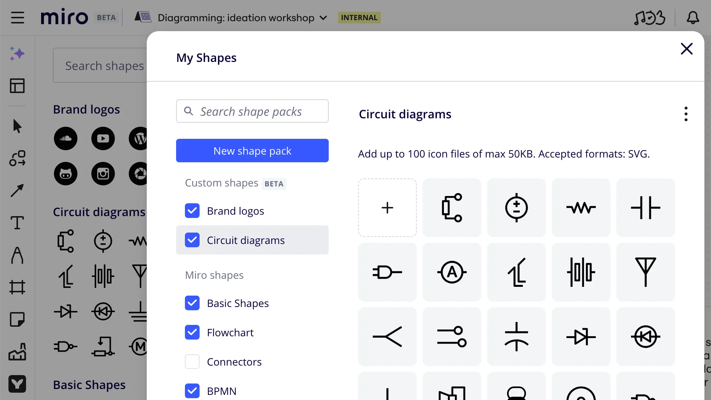
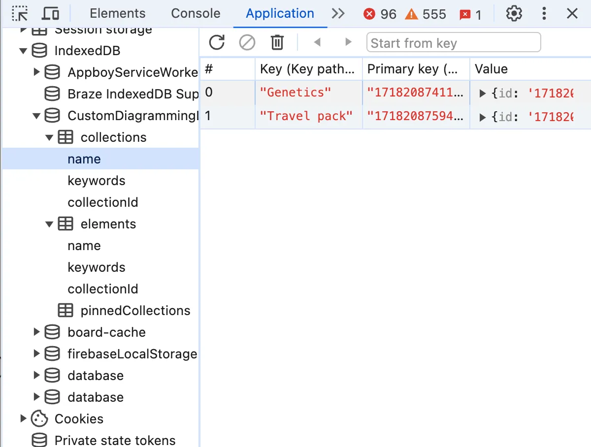

Long story short, we (Diagramming team at Miro) are shipping custom shape libraries soon. Users will be able to create their own shape packs, upload SVG icons into them, share the packs with their respective organisations and use the icons for advanced diagramming exactly in the same way as they use the native Miro shapes (e.g. AWS, Cisco, Salesforce, etc.). We've created an early iteration of the feature with fake CRUD back-end fully implemented on client-side and hereunder I'll tell how we did it and how it improved the feature delivery time.

> Custom shape libraries is one of many impressive changes announced on the 17th of July, including, among others, [Intelligent canvas](https://miro.com/intelligent-canvas/).



Demo version of custom shape packs using the indexedDB as a back-end substituteMaking and remaking a plan

It all started during planning of custom shape packs. We knew the feature required both server and client parts, and, as all cool folks do nowadays, we decided to go [API-first](https://www.postman.com/api-first/). We created a list of endpoints and agreed on message formats with the idea to develop further both client and server in parallel.

What initially seemed to be a standard CRUD, quickly turned out to be a complex server-heavy project full of external dependencies because we want to deliver only enterprise-grade solutions. We had to think of subscription plans, permission management, authorisation, matching file and board access rights, the list goes on and on. Enterprise stuff. Sophisticated stuff.
Having understood that we wouldn't have a working server anytime soon, we looked for another way to unblock client development. We can mock the API. For instance, we can use Postman or at least hard-code some static data of the desired format. Or we could do better?

What if we not just displayed test data for development purposes but provided a real, fully functional version one could actually use and even demonstrate, not just superficially test for UI bugs on static mock data? What if we added a whole another iteration of the feedback loop even before internal Miro release, using our team and a selection of interested insiders as a Customer -1 (i.e. even before the Customer 0)?

It sounded like a good idea. We'd create an in-browser backend and provide a first demo version very fast without having to wait for the real server to be released.

## Don't use local storage

When it comes to storing data between sessions in browser, the first natural reaction is often "OK, we'll use local storage". If you resist this impulse for a moment and imagine what can go wrong, you quickly find plenty of such things:

* **LocalStorage is limited to 5MB per domain**, which might seem more than enough for your task, but in a large product with many moving parts you never know what other teams are up to: whether they are storing files or binary data for their features, or using local storage to manually cache documents, or maybe they did it long time ago for some subset of important users you never heard of, and forgot to clean up afterwards.
* **LocalStorage can store only strings** and you have to rely on slow and fragile manual serialization to store anything else.
* **LocalStorage is key-value only.** No support for even basic queries like selecting a record by field value, sorting, filtering, etc. To perform any query except "get value by its key", you'll have to iterate through all records, parse each of them and compare.
* **LocalStorage is synchronous** and isn't supported in workers, so whenever you access a value to either read or write, it blocks execution flow, and we're talking disk operations here, not RAM.

So, a use case really suitable for local storage would be to store a single value that you aren't going to read any often, and only when no major user flow depends on the stored value being accessible. Another one would be prototyping, just because reading and writing to local storage is almost as straightforward as getting the value from a map. If you're developing a product all on your own or in a very small team where everyone knows what everyone else is doing, local storage can also be the answer.

Neither of the above looks like our case. We need something else.

_Of course, not all of the listed points are always relevant for your particular case, but if you notice at least one, consider a better alternative, which is…_

### IndexedDB
Basically, IndexedDB is the local storage made right. It's an in-browser NoSQL database suitable even for large data structures. 

It supports indexing for fast querying. It is asynchronous and supported in WebWorkers, and, on top of that, it uses [Structured clone algorithm](https://developer.mozilla.org/en-US/docs/Web/API/Web_Workers_API/Structured_clone_algorithm), which means that it can work with complex data structures the same way as [`postMessage`](https://developer.mozilla.org/en-US/docs/Web/API/Window/postMessage) and other modern WebWorker-friendly web APIs do, so you don't have to rely on manual JSON serialisation.



Once created, indexedDB can be seen and explored in the same place in dev tools as localStorage and cookies: "Application" tab


## Making it
Let's create a fake back-end step-by-step together. It will be a slightly simplified version of the real thing we've created, because the real thing has duplications and features that are too specific to be used as generic examples in an article like this.

Our fake API will be a class having one public asynchronous method per supposed REST endpoint. Let's define the interface first and annotate it with endpoint signatures:

```typescript
interface DemoElement {
 id: string,
 name: string,
 collectionId: string,
}

interface IFakeBackendDemo {
 /**
  * [GET] /elements/{elementId} -> DatabaseItem
  * @param id element id
  * @returns element with the given id or throws exception if not found
 */
 getElementById(id: string): Promise<DemoElement>

 /**
  * [POST] /elements/{collectionId} -> DatabaseItem
  * HTTP Body {File} file
  * @param collectionId id of the collection to which the element belongs
  * @returns newly created element
 */
 createElement(collectionId: string, file: File): Promise<DemoElement>

 /**
  * [PATCH] /elements/{elementId} -> DatabaseItem
  * HTTP Body {File} file
  * @param element updated element data
  * @returns updated element with the given id
 */
 updateElement(element: DemoElement): Promise<DemoElement>

 /**
  * [DELETE] /elements/{elementId} -> void
  * @param id id of the element to delete
 */
 deleteElement(id: string): Promise<void>

 /**
  * [GET] /elements/?collectionId={collectionId} -> DatabaseItem[]
  * @param collectionId id of the collection to which the elements belong
  * @returns all elements with the given collectionId
 */
 getElementsByCollectionId(collectionId: string): Promise<DemoElement[]>
}
```

Having defined an interface, we'll be free to substitute it with another implementation making real API calls. Let's implement it.

> There are handy wrapper libraries providing Promise-based API on top of IndexedDB: for instance, [idb](https://github.com/jakearchibald/idb). I did not want to bring in an additional library and used the low-level interface, which is also better for educational purposes, so I'll be using the native IndexedDB API here as I did in the real case.

### Connect to database

First, we'll need a database. We'll create it in the class constructor by calling [`window.indexedDB.open()`](https://developer.mozilla.org/en-US/docs/Web/API/IDBFactory/open).

```typescript
export class FakeBackendDemo implements IFakeBackendDemo {
 private db?: IDBDatabase
 constructor() {
  const request = window.indexedDB.open('DIAG-1234-BackendMockDemo', 1)

  request.onerror = () => {
   throw new Error(`can't connect to indexed db`)
  }
  request.onsuccess = event => {
   this.db = (event.target as IDBRequest<IDBDatabase>).result
  }
 }
}
```

If there is no IndexedDB database with the name specified in the first argument, it will create one and open a connection. All operations on indexedDB are asynchronous and have [`success`](https://developer.mozilla.org/en-US/docs/Web/API/IDBRequest/success_event) and [`error`](https://developer.mozilla.org/en-US/docs/Web/API/IDBRequest/error_event) events. Once we've opened the connection, we'll save the database reference in a class field.

### Create object stores and indexes

The only place where one can alter the indexedDB database structure is inside [`upgradeneeded`](https://developer.mozilla.org/en-US/docs/Web/API/IDBOpenDBRequest/upgradeneeded_event) event handler. It is called whenever the database in the user's browser has lower version than the one specified in the second argument of `indexedDB.open()` call or doesn't exist, in which case the current version number is considered to be equal `0`.

Databases are local to users and easily can become outdated. Lucky enough, indexedDB supports versioning. There are multiple approaches you can use to form the database. For instance, you can check if each particular object store exists and create them in case if they don't:

```typescript
request.onupgradeneeded = (event: IDBVersionChangeEvent) => {
 const db = (event.target as IDBRequest<IDBDatabase>).result

 if (!db.objectStoreNames.contains('elements')) {
  const elementStore = db.createObjectStore('elements', {keyPath: 'id'});

  // Create an index for faster querying: we're going to query by collectionId
  if (!elementStore.indexNames.contains('collectionId')) {
   elementStore.createIndex('collectionId', 'collectionId', {unique: false})
  }
 }
}
```

Alternatively, you can consider the database structure a result of stacked consecutive migrations and apply them depending on the current user's db version.

```typescript
  request.onupgradeneeded = (event: IDBVersionChangeEvent) => {
   const db = (event.target as IDBRequest<IDBDatabase>).result
 
   switch(event.oldVersion) { // existing db version
    case 0: // version 0 means that the client had no database
     // apply first migration
     const elementStore = db.createObjectStore('elements', {keyPath: 'id'});
     // Create an index for faster querying: we're going to query by collectionId
     elementStore.createIndex('collectionId', 'collectionId', {unique: false})
    case 1:
     // here will go your second migration, etc.
    default:
     throw new Error(`error updating a database: unsupported version of db`)
   }
  }
```
Note that we've created an index for `collectionId` here, and it is set to be not unique, meaning that there can be multiple elements in a collection and we intend to get all of them in one query.

### Getting elements

Now let's implement each API method we've defined in the interface above

```typescript
 async getElementById(id: string): Promise<DemoElement> {
  if (!this.db) {
   throw new Error('db is not initialized')
  }

  const transaction = this.db.transaction('elements', 'readonly')
  const elementStore = transaction.objectStore('elements')
  const request = elementStore.get(id)

  // returning a promise that would resolve once the db request is successful and reject in case of error
  return new Promise((resolve, reject) => {
   request.onsuccess = () => {
    resolve(request.result)
   }
   request.onerror = () => {
    reject(new Error(`element with id ${id} not found`))
   }
  })
 }
```
One thing to note here is the transaction type. It can be either `readonly` or `readwrite`. `readonly` transactions are much faster because multiple readonly transactions can be executed in parallel. On the contrary, a `readwrite` transaction would block other transactions from happening so that the data state stays consistent.

You don't have to explicitly open the transaction as `readonly`. It is readonly by default, unless explicitly opened as `readwrite`.

> There is also the third transaction type called `versionchange` where you are allowed to create and delete object stores and indexes, but you cannot open such a transaction manually. Instead, it is opened for you automatically inside a `versionchange` event listener, so that listener is the only place where you can create and delete stores and indexes.

In a similar way, but using an index and its `getAll` method, we're implementing the query returning all elements of a given collection.
```typescript
 async getElementsByCollectionId(collectionId: string): Promise<DemoElement[]> {
  if (!this.db) {
   throw new Error('DB not initialized')
  }
  const transaction = this.db.transaction('elements', 'readonly')
  const elementStore = transaction.objectStore('elements')
  const index = elementStore.index('collectionId')
  const request = index.getAll(collectionId)

  return new Promise((resolve, reject) => {
   request.onsuccess = () => {
    resolve(request.result)
   }
   request.onerror = () => {
    reject(request.error)
   }
  })
 }
```

### Create new elements

Create, update and delete operations are very similar to each other but there are a couple of remarkable differences. Let's start with creation

```typescript
 async createElement(collectionId: string, file: File): Promise<DemoElement> {
  if (!this.db) {
   throw new Error('DB not initialized')
  }

  const {data} = await this.fileUploader.uploadFile(file)

  const newElement = {
   id: data.id,
   name: data.name,
   collectionId,
  }

  const request = this.db.transaction('elements', 'readwrite')
   .objectStore('elements')
   .add(newElement)

  return new Promise((resolve, reject) => {
   request.onsuccess = () => {
    resolve(newElement)
   }
   request.onerror = () => {
    reject(request.error)
   }
  })
 }
```

What is important to note is that we are using `objectStore.add()` to add a new element. This is not the only way to create new elements as we'll see in a bit, but `add` will run the `onerror` flow if a record with the same key already exists (in our case, `id` field), which prevents us from unknowingly overwriting existing elements.

The second important detail here is the type of transaction. We use `readwrite`, otherwise we would get an access error trying to perform a write operation.

The `fileUploader` in the example is an abstract external service we use to upload files. We can get it in the constructor like this:

```typescript
interface FileUploader {
 uploadFile(file: File): Promise<{data: {id: string, name: string}}>
}

//...

export class FakeBackendDemo implements IFakeBackendDemo {
// ...
 constructor(private fileUploader: FileUploader) {
// ...
```

### Update existing elements

Update of existing elements has just one important difference from addition:

```typescript
 async updateElement(element: DemoElement): Promise<DemoElement> {
  if (!this.db) {
   throw new Error('DB not initialized')
  }
  const request = this.db.transaction('elements', 'readwrite')
   .objectStore('elements')
   .put(element)

  return new Promise((resolve, reject) => {
   request.onsuccess = () => {
    resolve(element)
   }
   request.onerror = () => {
    reject(request.error)
   }
  })
 }
```

The difference is that we use `put` instead of `add`. put will update an existing element if there already is one with the specified key, otherwise it will create one (`add` would fire the `error` event).

Technically speaking, nothing prevented us from using it in the element creation example as well, so it really depends on your use case and the particular task's requirements.

### Delete elements

Probably, by now you can guess what follows next.
```typescript
 async deleteElement(id: string): Promise<void> {
  if (!this.db) {
   throw new Error('DB not initialized')
  }
  const request = this.db.transaction('elements', 'readwrite').objectStore('elements').delete(id)
  return new Promise((resolve, reject) => {
   request.onsuccess = () => {
    resolve()
   }
   request.onerror = () => {
    reject(request.error)
   }
  })
 }
```
Nothing to add here, except that we use `delete` by key. If there is no element with such key, we'll end up in the `onerror` listener.

To delete all entries in a store at once (if you feel funky), you can call `.clear()`

```typescript
this.db.transaction('elements', 'readwrite').objectStore('elements').clear()
```

[Full code of the example in the article](https://gist.github.com/oshibka404/391254fc19fb5218e355909af8176cee)

## Postscript

> If you're not really interested in providing a usable demo version or don't need state persisting between sessions, you're probably better off mocking API using Postman or hard-coding some data as a plain JS object literal instead of creating a database.

Also, please note that there are many useful things in indexedDB that we haven't covered in this tutorial. There are cursors, ranges, abort events, and many more. To learn about them, you can read, for instance, a [comprehensive guide on indexedDB](https://javascript.info/indexeddb) by Ilya Kantor or, needless to say, [MDN page](https://developer.mozilla.org/en-US/docs/Web/API/IndexedDB_API/Using_IndexedDB).

[Stop Using localStorage!](https://medium.com/@julienetienne/stop-using-localstorage-64a6d6805da8) - Another list of mostly reasonable arguments pro et contra indexedDB vs. localStorage and some interesting bits of history, including the rise and fall of WebSQL.
