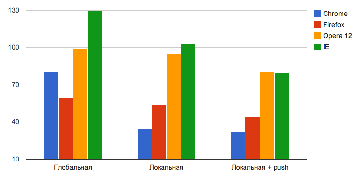
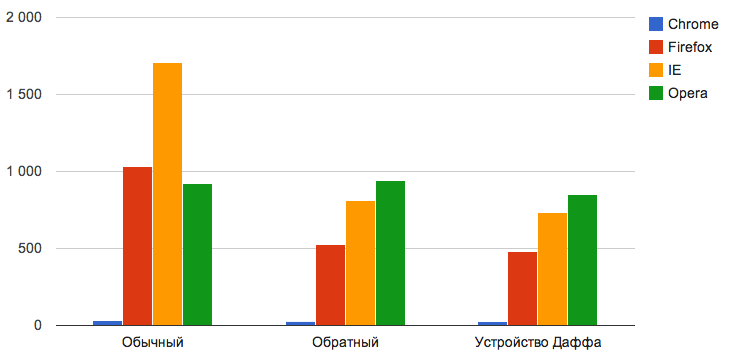

Одно из главных правил разработки фронтенда веб-приложения — делать так, чтобы пользователь чувствовал полный контроль над его интерфейсом. А для этого надо заставить приложение реагировать на действия пользователя моментально, то есть сделать задержку между действием пользователя и откликом интерфейса незаметной. В этой статье я опишу несколько приемов оптимизации производительности, которые помогут заставить медленное приложение летать.

> Статья написана в 2014 году и морально устарела. Большую часть этих оптимизаций теперь и так делают JS-движки. Не стоит использовать описанные здесь техники.

## Области видимости
Объяснять, что глобальные переменные — это зло, не надо — это и так понятно. Но почему зло и насколько оно большое, мы попробуем разобраться. Возьмем для примера простой код, совершающий обход массива и производящий с каждым элементом какое-нибудь простое действие. Создадим массив из 100 000 элементов и запишем в каждый из них случайное число.

```js
var arr = new Array(100000);
(function() {
    for (var i = 0; i < arr.length; i++) {
        arr[i] = Math.random();
    }
})();
// Время выполнения — 81 мс
```

Здесь в функции осуществляется обход массива, находящегося в глобальной области видимости. Интерпретатор, увидев в условии `arr.length`, начинает поиск переменной `arr`. Первым делом он ищет в локальной области видимости, то есть внутри функции. Однако внутри функции переменная `arr` не объявлена. Тогда интерпретатор переходит в цепочке областей видимости на уровень выше (в нашем случае, к счастью, — сразу в глобальную область, хотя могло быть и хуже) и осуществляет поиск там. Тут он наконец находит переменную arr и ищет у содержащегося в ней объекта свойство `length`. Поиск по каждой области видимости занимает драгоценное время. Попробуем переписать функцию так, чтобы ей не приходилось на каждой итерации цикла обращаться в другие области видимости.

```js
var arr = new Array(100000);
(function() {
    var a = arr;
    for (var i = 0; i < a.length; i++) {
        a[i] = Math.random();
    }
})();
// Время выполнения — 35 мс
```

Такая, казалось бы, мелкая оптимизация дает в Chrome удивительный прирост производительности — в 2,5 раза (35 мс вместо 81). В Firefox прирост менее ощутим, но тоже есть: 54 мс вместо 60, то есть на 10%. В Opera 12 время выполнения сокращается еще менее значительно: с 99 до 95 мс.

Что касается работы с массивом, то мы можем дополнительно оптимизировать тело цикла, использовав вместо обращения к каждому конкретному элементу массива метод push:

```js
var arr = [];
(function () {
    var a = arr, length = 100000;
    for (var i = 0; i < length; i++) {
        a.push(Math.random());
    }
})();
// Время выполнения — 32 мс
```

Методы встроенных объектов благодаря низкоуровневым оптимизациям в движках почти всегда работают быстрее, чем вручную написанные на JavaScript аналоги. Особенно разница в производительности между встроенными методами и собственноручно написанными аналогами заметна в Firefox, Opera, Safari и IE. В V8 (Chrome) большая часть встроенных JavaScript-методов написана на том же JavaScript, поэтому прирост скорости работы не так велик.

Там, где это возможно (а это — практически везде), стоит переносить данные в как можно более локальную область видимости. К примеру, использовать шаблон немедленно вызываемых функций. То есть вместо такого кода:

```js
var div = document.getElementById('id');
div.style.color = '#f00';
лучше написать такой:

(function() {
    var div = document.getElementById('id');
    div.style.color = '#f00';
})();
```

А еще лучше — сделать так, чтобы даже для получения объекта document функции не приходилось искать в глобальном пространстве имен:

```js
(function(document) {
    var div = document.getElementById('id');
    div.style.color = '#f00';
})(document);
```

Здесь мы передали объект document в анонимную функцию в качестве аргумента, таким образом перенесли его в локальное для этой функции пространство имен. Этот же паттерн принято использовать в плагинах jQuery:

```js
;(function ($) {
    //...
})(jQuery);
```

Предваряющая точка с запятой в jQuery-плагинах избавляет от возможных ошибок, появляющихся при объединении нескольких плагинов минификаторами и препроцессорами, когда в конце кода одного из плагинов отсутствует завершающая точка с запятой.



## Циклы
Для того, чтобы снизить время работы цикла, очевидно, надо сократить или число операций в каждой итерации, или количество самих итераций. И даже если вы уже оптимизировали тело цикла, а производительность все равно недостаточна, выход есть. Можно сократить количество неочевидных операций, выполняемых интерпретатором. Ранее мы уже заставили интерпретатор не ходить на каждой итерации во внешние области видимости, теперь попробуем продолжить оптимизацию.

Простой и очень красивый прием сокращения времени работы цикла состоит в том, чтобы изменить направление обхода на противоположное, то есть вместо

```js
for (var i = 0; i < length; i++) {}
```
писать

```js
for (var i = length; i--; ) {}
```

или даже так:

```js
for ( ; length--; ) {}
```

Применив эту оптимизацию к предыдущему примеру, получаем:

```js
var arr = [];
(function () {
    var a = arr, length = 100000;
    for (var i = length; i--; ) {
        a.push(Math.random());
    }
})();
```

В Chrome этот прием в данном случае дает прирост производительности в 10% (с 32 до 29 мс), в Opera 12 время выполнения практически не меняется (923 и 939), однако в Firefox и IE оно сокращается в два раза: c 1030 до 525 мс для Firefox и с 1705 до 812 для IE. Чтобы разобраться в причинах такого эффекта, разберем все операции, которые производит интерпретатор на каждой итерации цикла.

В первом случае последовательность действий будет такой:

1. Вычислить значение булева выражения i < 10000000.
2. Сравнить полученное значение с true.
3. Инкрементировать i.

Во втором случае — такой:

1. Сравнить значение i с true.
2. Декрементировать i.

В соответствии с «правилом лжи» любое ненулевое числовое значение `i` приводится к `true`. К `false`, напомню, приводятся только `0`, `NaN`, `null`, `undefined` и пустая строка (`""`).

Менее изящный, но довольно эффективный метод оптимизации циклов заключается в том, чтобы развернуть тело цикла, увеличив количество операций в каждой итерации, но снизить количество самих итераций. Такой прием называется «Устройство Даффа» (Duff’s service). Для него придется пожертвовать красотой и лаконичностью кода, но в случаях, когда производительность важнее краткости, этот прием придется кстати. К примеру, мы можем заменить такой код:

```js
var length = 99999;
for (var i = length; i--; ) {
    a.push(Math.random());
}
```
на вот такой:
```js
var length = 99999,
iterations = Math.floor(length / 8),
startFrom = length % 8;

switch (startFrom) {
    case 0: arr.push(Math.random()); iterations--;
    case 7: arr.push(Math.random());
    case 6: arr.push(Math.random());
    case 5: arr.push(Math.random());
    case 4: arr.push(Math.random());
    case 3: arr.push(Math.random());
    case 2: arr.push(Math.random());
    case 1: arr.push(Math.random());
}

for (var i = iterations; i--; ) {
    arr.push(Math.random());
    arr.push(Math.random());
    arr.push(Math.random());
    arr.push(Math.random());
    arr.push(Math.random());
    arr.push(Math.random());
    arr.push(Math.random());
    arr.push(Math.random());
}
```
Это сократит время выполнения на 10% в Opera 12, а в Chrome и Firefox — на 20%. Мы уменьшили количество итераций в восемь раз, как следствие — в восемь же раз снизили число накладных проверок, неизбежно выполняемых при каждом повторении цикла. Ну а для того, чтобы обеспечить корректную работу с количеством повторений, не кратным восьми, использовали конструкцию `switch` c «проваливанием» в следующий case (обрати внимание, что в конце каждого `case` отсутствует директива `break`).

Мы можем сделать то же самое короче, заменив switch на цикл, практически без потери производительности:

```js
var length = 99999,
    iterations = length % 8;
while (iterations) {
    arr.push(Math.random()); 
    iterations--;
}
iterations = Math.floor(length / 8);
for (var i = iterations; i--; ) {
    arr.push(Math.random());
    arr.push(Math.random());
    arr.push(Math.random());
    arr.push(Math.random());
    arr.push(Math.random());
    arr.push(Math.random());
    arr.push(Math.random());
    arr.push(Math.random());
}
```
Данный прием эффективен только при большом количестве итераций.



## Функции и методы
Когда одна и та же функция вызывается неоднократно, полезно будет использовать прием «мемоизации» или, говоря проще, кеширования возвращаемого значения. Особенно этот прием полезен в том случае, если функция выполняет какие-то длительные операции. Рассмотрим его на примере вычисления факториала числа. Классическая рекурсивная функция вычисления факториала выглядит так:
```js
var factorial = function(n) {
    if (n == 0) return 1;
    return n * factorial(n-1);
}
```
Она выполняется достаточно быстро сама по себе, однако на ее примере можно красиво продемонстрировать прием мемоизации.
```js
var factorial = function(n) {
    var cache = {
        0: 1,
        1: 1
    }

    factorial = function(n) {
        if (!cache[n]) {
            cache[n] = n * factorial(n-1);
        }
        return cache[n];
    }

    return factorial(n);
}
```
Кеш значений доступен через замыкание, это исключает его непреднамеренное изменение — доступ к нему имеет только функция factorial. Допустим, нам нужно последовательно вычислить факториалы 100, 101 и 102. При использовании классической рекурсивной функции мы сначала вычислим факториал числа 100 (100! = 100 * 99 * 98 … * 1 или 100 * 99!), затем — числа 101 (101! = 101 * 100 * 99 … * 1 или 101 * 100!), а затем — факториал числа 102 (102! = 102 * 101 * 100 … * 1 или 102 * 101!). Таким образом, факториал числа 101 вычислится дважды, а числа 100 — аж трижды. Мемоизация значений позволяет этого избежать. При использовании кеширования результатов мы сначала вычисляем значение 100!, а при вычислении 101! повторные вычисления производиться не будут. Вместо этого из кеша будет извлечено уже вычисленное значение 100, умножено на 101 и возвращено. Таким образом мы избегаем огромного количества необязательных вычислений. Особенно ярко эффект мемоизации заметен при выполнении медленных, ресурсоемких операций (например, работы с DOM-деревом). Однако при использовании этого приема нужно быть уверенным в том, что при каждом последующем вызове функции с одними и теми же аргументами возвращаемый ею результат должен быть тем же, что и в предыдущий раз. Поэтому кеширование не подходит для обработки динамически изменяющихся данных.

## Работа с DOM
Операции с DOM-деревом — одни из самых медленных в JavaScript. Джон Хрватин из Microsoft сравнил DOM и JavaScript с двумя островами, связанными мостом с платным проездом. Платить, конечно же, приходится производительностью. Поэтому для того, чтобы увеличить скорость работы клиентской части приложения, стоит минимизировать количество пересечений этого моста. Самое простое и очевидное — сохранять многократно используемые HTML-элементы в переменные.

```js
// Плохой код
document.getElementById('block').innerHTML += "Первая строка";
document.getElementById('block').innerHTML += "Вторая строка";
document.getElementById('block').innerHTML += "Третья строка";

// Лучше
var block = document.getElementById('block');

block.innerHTML += "Первая строка";
block.innerHTML += "Вторая строка";
block.innerHTML += "Третья строка";
```
Однако и это еще не все. Столь же долго, как и операции получения элемента DOM, выполняются операции перерисовывания страницы. Рендеринг страницы происходит каждый раз, когда ты изменяешь форму элементов: изменяешь в блоках текст, добавляешь новые блоки в layout страницы, изменяешь стили элементов. Чтобы минимизировать время, которое браузер тратит на перерисовывание страницы, необходимо объединять несколько идущих друг за другом операций, меняющих вид документа, в одну везде, где это возможно.
```js
// Еще лучше

var block = document.getElementById('block'),
    string = "Первая строка";

string += "Вторая строка";
string += "Третья строка";

block.innerHTML += string;
```
Если по каким-то причинам так сделать не получается и все-таки необходимо добавлять содержимое в элемент несколько раз подряд, лучше будет удалить элемент из потока, совершить все необходимые действия над ним, после чего незаметно вернуть его на место. Такие простые операции, как правило, протекают очень быстро, так что пользователь, скорее всего, этого даже не заметит.
```js
var block = document.getElementById('block');

block.style.display = "none";

block.innerHTML += "Первая строка";
block.innerHTML += "Вторая строка";
block.innerHTML += "Третья строка";

block.style.display = "block";
```

## Измерение времени работы скрипта

Простейший способ измерить время работы:
```js
var startTime = +new Date();
/* тестируемый код */
console.log(+new Date - startTime);
```

Больше возможностей предоставляет библиотека YUI — в нее включен мощный модуль профилирования. Также инструменты профилирования, позволяющие количественно измерить производительность, имеются в «Инструментах разработчика» любого современного браузера. Подробное описание работы с ними можно найти в книге Николаса Закаса «JavaScript: Оптимизация производительности» или, как и многое другое, в официальной документации к браузеру.

## Заключение
Незначительные и неочевидные на первый взгляд приемы программирования могут обеспечить твоему приложению многократный прирост производительности и спасти твоих пользователей от раздражающих подтормаживаний и утомительного ожидания, а тебя — от вопросов в техническую поддержку и от неудовлетворенных юзеров. Конечно, если применять эти приемы с умом.
