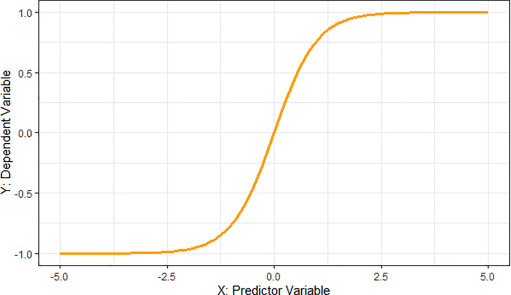
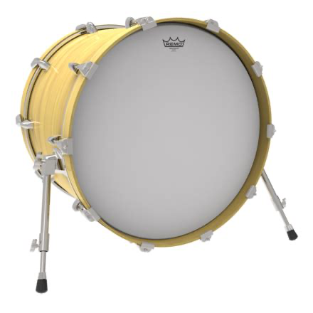
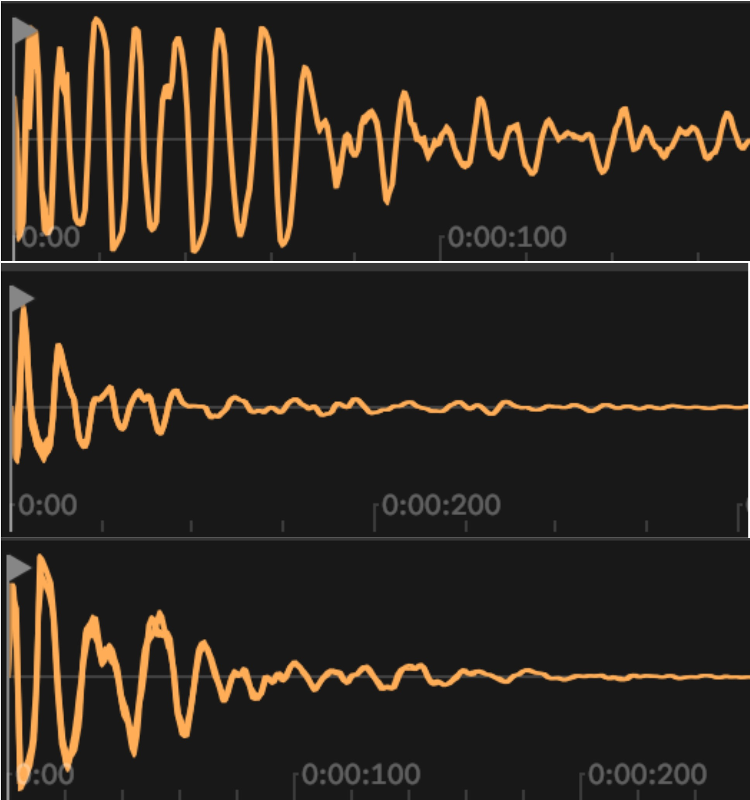
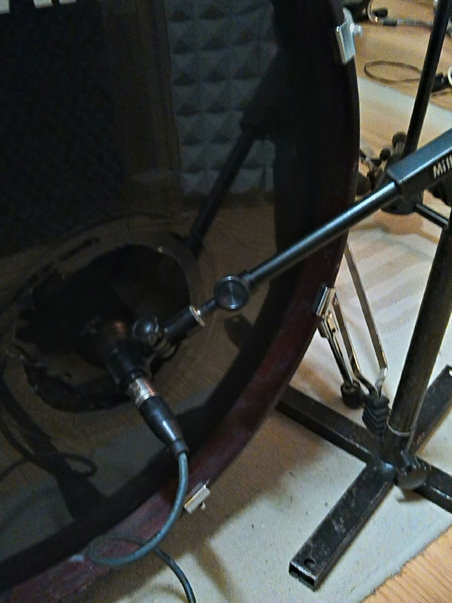

Kick drum is not my favourite instrument, nor is it the easiest to program, but I nevertheless picked it for my first tutorial. It is for two reasons:

1. I start almost each my music production from a kick pattern in a chosen tempo. Then I add snare and hi-hats on top and use the drum loop as a skeleton to layer harmonic and melodic ideas on top of it. Then I iterate on the underlying rhythm or even get rid of it for good. It means that the bass drum is the first sound I have in the mix, and it influences all my further sonic decisions, which makes it pretty important. 
2. The second reason is that I recently watched an outstanding sound design tutorial by Zion Jaymes on YouTube. Zion's video got me inspired, and the inspiration is such a precious feeling that I just have to do something while it lasts.
    <iframe width="560" height="315" src="https://www.youtube-nocookie.com/embed/ndG-6-vONNc?si=C3UXIwcGr-5eUEPI" allow="accelerometer; autoplay; clipboard-write; encrypted-media; gyroscope; picture-in-picture; web-share"></iframe>

We'll start from a classic 808-style electronic kick sound. Then we'll explore different ways of making the sound more realistic, resembling the acoustic bass drum. Then we'll take a 90-degree turn and try to use other sounds we can make using this technique, to get a sound that doesn't copy an acoustic drum but can serve the same purpose in a composition.

# Setting up

In this tutorial, I'll be using [Faust](https://faust.grame.fr) because I know it and I like it. Faust is an incredibly concise language – you can get pretty sophisticated timbres in few lines of code; it's designed specifically for audio; it compiles into a very performant C++ code which can be easily wrapped as a mobile application or a VST plugin, or an embedded system, or a web page. This also allows me to have interactive examples in this tutorial.

You can follow the whole tutorial with only a web-based [Fause IDE](https://faustide.grame.fr) or even just interactive boxes right on this page. I won't explain language syntax here, but you should be able to pick up some of it as we go. The syntax might look somewhat quirky at first, especially for those who, as myself, come from the imperative programming background. If it becomes too much, put this tutorial aside and start from [Quick start with Faust](https://faustdoc.grame.fr/manual/quick-start/).

To run a code example, press the play button at its left top.

# Kick from the standard library

The easiest way to create a bass drum in Faust is to call `sy.kick` from the standard library.

<faust-editor>
<!--
sy = library("synths.lib");
gate = button("gate");
process = sy.kick(60, 0.2, 0.01, 0.5, 3, gate);
-->
</faust-editor>

You can set base pitch, click, attack, decay, drive. It alone lets you create a wide variety of sounds: clicky, punchy, acid, dirty.

<faust-editor>
<!--
sy = library("synths.lib");
click_gate = button("click:gate");
click_kick = sy.kick(60, 0.02, 0.01, 0.1, 1, click_gate);
acid_gate = button("acid:gate");
acid_kick = sy.kick(80, 0.1, 0.01, 0.5, 2, acid_gate);
dirty_gate = button("dirty:gate");
dirty_kick = sy.kick(80, 0.05, 0.05, 1, 5, dirty_gate);
process = click_kick + acid_kick + dirty_kick;
-->
</faust-editor>

By just randomly tweaking these parameters, you can get quite far. Give it a try:

<faust-editor>
<!--
sy = library("synths.lib");
pitch = hslider("pitch", 60, 30, 120, 0.1);
click = hslider("click", 0.01, 0.005, 1, 0.001);
attack = hslider("attack", 0.01, 0.005, 0.2, 0.01);
decay = hslider("decay", 0.5, 0.01, 2, 0.01); 
drive = hslider("drive", 3, 1, 10, 0.1);
gate = button("gate");
process = sy.kick(pitch, click, attack, decay, drive, gate);
-->
</faust-editor>

# 808 or decaying sine wave

Let's dive into the [source code of synths' library](https://github.com/grame-cncm/faustlibraries/blob/31fbccf81a99ffb894ea0b4cd9e9b16f2ab53a26/synths.lib#L332) and find out what `sy.kick` does under the hood:

```
kick(pitch, click, attack, decay, drive, gate) = out
with {
    env = en.adsr(attack, decay, 0.0, 0.1, gate);
    pitchenv = en.adsr(0.005, click, 0.0, 0.1, gate);
    clean = env * os.osc((1 + pitchenv * 4) * pitch);
    out = ma.tanh(clean * drive);
};
```

it has two envelopes:
- `env` defines how amplitude rises and drops (according to provided `attack` and `decay`)
- `pitchenv` defines how fast the pitch drops, creating a click if it's short, and a "pew" sound, if longer.

Then we create a  the sine wave oscillator (`os.osc`) on a frequency defined by `pitchenv`, dropping from the value 5 times higher than the base pitch.

`ma.tanh` calculates a hyperbolic tangent of the signal value multiplied by `drive`, and it's a clever way to add a touch of soft-clipping overdrive. Input values from -1 to 1 are changing almost linearly, and then the growth quickly but smoothly slows down, capped at 1. Exactly what we need for soft clipping



It is fun and works well in many genres of music, but doesn't sound like a real bass drum at all. To improve it, we'll need more control. We will be adding modifications in the middle of this signal chain, so I'll extract the kick source code and re-write it in a more linear fashion.

<faust-editor>
<!--
sy = library("synths.lib");
ma = library("math.lib");
os = library("oscillators.lib");
en = library("envelopes.lib");
// UI controls
base_pitch = hslider("base_pitch", 60, 30, 120, 0.1);
click = hslider("click", 0.01, 0.005, 1, 0.001);
attack = hslider("attack", 0.01, 0.005, 0.2, 0.01);
decay = hslider("decay", 0.5, 0.01, 2, 0.01); 
drive = hslider("drive", 3, 1, 10, 0.1);
gate = button("gate");
// envelopes
amp_env = en.ar(attack, decay, gate);
pitch_env = en.ar(0.005, click, gate);
pitch = base_pitch * (1 + pitch_env * 4);
clean = os.osc(pitch) * amp_env;
// apply overdrive
process = ma.tanh(clean * drive);
-->
</faust-editor>

I promise we'll get back to this approach, but for now let's step back and take a closer look at the sound we're trying to replicate.

# How a drum makes a sound

We are trying to replicate the sound of this:



A wooden barrel (drum body) with two sides covered by a plastic membrane (drum head), one of which is being hit by a beater. The membrane vibrates, and if you are familiar with the string harmonics model, this one is not the same at all. 

This is harmonics of the string. Neat and simple.


Imagine the same, but every wave spreads in all directions across the membrane, reflexes from its edges, interferes with other reflections, excites the body of the barrel and the air in it and gets immediately excited back. Also, every part resonates on its natural frequency. Sounds like it would be insane to model, and it is. Fortunately for us, this sound is so harmonically complex and the harmonics are so randomly spread across the frequency spectrum that it sounds pretty much like a short burst of noise mixed with a quickly decaying sine-ish wave.



Beater hitting the drum head makes the click (short burst of noise), and the drum head briefly vibrates at its natural frequency, producing the pitched tail. Let's try to naively program exactly that.

<faust-editor>
<!--
sy = library("synths.lib");
ma = library("math.lib");
os = library("oscillators.lib");
en = library("envelopes.lib");
no = library("noises.lib");
gate = button("gate");
mix_noise = hslider("noise/pitch", 0.3, 0, 1, 0.01);
amp_env = en.ar(0.005, 0.3, gate);
noise_env = en.ar(0.005, 0.02, gate);
pitched_tone = os.osc(60) * amp_env * (1 - mix_noise);
noise_burst = no.pink_noise * noise_env * mix_noise;
process = pitched_tone + noise_burst;
-->
</faust-editor>

I used pink noise instead of white (more low frequencies, less high frequencies), because it feels somewhat more natural.

We can try combining these approaches: add the frequency envelope to the sine wave to make the click more distinct.

<faust-editor>
<!--
sy = library("synths.lib");
ma = library("math.lib");
os = library("oscillators.lib");
en = library("envelopes.lib");
no = library("noises.lib");
gate = button("gate");
mix_noise = hslider("noise/pitch", 0.3, 0, 1, 0.01);
amp_env = en.ar(0.005, 0.3, gate);
click_env = en.ar(0.005, 0.01, gate);
pitch = 60 * (1 + click_env * 4);
pitched_tone = os.osc(pitch) * amp_env * (1 - mix_noise);
noise_burst = no.pink_noise * click_env * mix_noise;
process = pitched_tone + noise_burst;
-->
</faust-editor>

The click now is both a burst of noise and a high pitch quickly dropping to the drum head vibration frequency that quickly decays. Let's bring back all the controls we had before so that we can tweak them and play around.

<faust-editor>
<!--
sy = library("synths.lib");
ma = library("math.lib");
os = library("oscillators.lib");
en = library("envelopes.lib");
no = library("noises.lib");
// UI controls
base_pitch = hslider("base_pitch", 60, 30, 120, 0.1);
click = hslider("click", 0.01, 0.005, 1, 0.001);
attack = hslider("attack", 0.01, 0.005, 0.2, 0.01);
decay = hslider("decay", 0.5, 0.01, 2, 0.01); 
drive = hslider("drive", 3, 1, 10, 0.1);
mix_noise = hslider("noise/pitch", 0.3, 0, 1, 0.01);
gate = button("gate");
// envelopes
amp_env = en.ar(attack, decay, gate);
click_env = en.ar(0.005, click, gate);
pitch = 60 * (1 + click_env * 4);
pitched_tone = os.osc(pitch) * amp_env * (1 - mix_noise);
noise_burst = no.pink_noise * click_env * mix_noise;
process = ma.tanh((pitched_tone + noise_burst) * drive);
-->
</faust-editor>

This is a nice sound, and it can be useful for many musical applications, but it still doesn't quite sound like a real drum. We treat noise here like it's a separate sound from a separate source that we mix with the pitched sound, whereas in reality we have a single vibrating system where connected parts are resonating and exciting each other. To replicate that without going deep into physical modeling, we will use frequency modulation (FM).

# Frequency modulation

I have a soft spot for FM synthesis. It's when you use one signal (modulator) to change the frequency of another signal (carrier). You can then do crazy things like using the third signal (second-order carrier) to modulate the frequency of the carrier, or use the resulting signal in a feedback loop to modulate one of its carriers, and so on. It is super fun to play with FM synthesis, and it's super easy to produce truly horrible ear-bleeding tones with it. But also some of the most satisfying synth sounds I've ever heard were FM.

The first commercially available FM synthesizer, the legendary [Yamaha DX7](https://en.wikipedia.org/wiki/Yamaha_DX7), was an instant hit, and Faust has a [whole library](https://faustlibraries.grame.fr/libs/dx7/dx7/) emulating it. We won't be using this library. Instead, we'll take a low-pitched sine wave (drum head's vibration) and use the short burst of pink noise (the click from the beater hitting the head) to modulate its frequency.

<faust-editor>
<!--
import("stdfaust.lib");
gate = button("kick");
//
mod_source = no.pink_noise + 1; // 0 to 2
modulation_envelope = en.ar(0.001, 0.1, gate);
modulator = mod_source * modulation_envelope;
//
amp_envelope = en.ar(0.001, 0.3, gate);
//
base_freq = 60;
carrier = os.oscsin(base_freq * modulator);
//
process = carrier * amp_envelope;
-->
</faust-editor>

To me, this sound resembles the real kick drum much more than previous examples. We're really having only a single simple sound source here (carrier sine wave), but the way it vibrates is getting formed by other contributing factors (noise). Let's fiddle durations and other parameters.

<faust-editor>
<!--
import("stdfaust.lib");
//
gate = button("kick");
attack = hslider("[3]Attack[scale:log][unit:s]", 0.005, 0.001, 0.4, 0.001);
decay = hslider("[4]Decay[scale:log][unit:s]", 0.5, 0.01, 1, 0.01);
amp_envelope = en.ar(attack, decay, gate);
//
mod_source = no.pink_noise + 1; // 0 to 2
modulation_amount = hslider("[6]Noise modulation amount", 2, 0.01, 5, 0.01);
modulation_decay = hslider("[7]Modulation decay[unit:s]", 0.1, 0.01, 1, 0.01);
modulation_envelope = en.ar(0.001, modulation_decay, gate);
modulator = mod_source * modulation_envelope * modulation_amount;
//
base_freq = 60;
carrier = os.oscsin(base_freq * modulator);
//
process = carrier * amp_envelope;
-->
</faust-editor>

# Add resonance

Bass drum has a body, and the body has its own natural frequency. Harmonically rich sound which a noise burst is, makes the body resonate on that frequency. We will emulate it using a [peak EQ](https://faustlibraries.grame.fr/libs/filters/#fipeak_eq) from Faust's `filters` library — `fi.peak_eq`.

<faust-editor>
<!--
import("stdfaust.lib");
//
gate = button("kick");
attack = hslider("[3]Attack[scale:log][unit:s]", 0.005, 0.001, 0.4, 0.001);
decay = hslider("[4]Decay[scale:log][unit:s]", 0.5, 0.01, 1, 0.01);
amp_envelope = en.ar(attack, decay, gate);
//
mod_source = no.pink_noise + 1; // 0 to 2
modulation_amount = hslider("[6]Noise modulation amount", 2, 0.01, 5, 0.01);
modulation_decay = hslider("[7]Modulation decay[unit:s]", 0.1, 0.01, 1, 0.01);
modulation_envelope = en.ar(0.001, modulation_decay, gate);
modulator = mod_source * modulation_envelope * modulation_amount;
//
base_freq = 60;
carrier = os.oscsin(base_freq * modulator);
//
resonance_freq = hslider("[8]Resonance freq[unit:hz]", 120, 60, 240, 1);
resonance_amount = hslider("[9]Resonance amount[unit:dB]", 6, 0, 24, 1);
process = carrier * amp_envelope : fi.peak_eq(resonance_amount, resonance_freq, 30);
-->
</faust-editor>

# Add overhead mic sound

We got a sound closely resembling what you hear from a microphone you put next to or inside the kick drum.



This is not exactly the sound you hear on a good studio recording. Or, more precisely, not _the only sound_ you hear. You hear the sound from overhead mics, and that sound has way less sub-bass and way more highs. It's more clicky and less boomy. It is a harmonically rich sound that quickly loses its upper harmonics. Also, it often has a subtle echo. Let's program it using a noise that starts white-ish and very quickly gets brown with a fast low-pass filter sweep (`fi.resonlp`).

<faust-editor>
<!--
import("stdfaust.lib");
//
gate = button("kick");
attack = hslider("[3]Attack[scale:log][unit:s]", 0.005, 0.001, 0.4, 0.001);
decay = hslider("[4]Decay[scale:log][unit:s]", 0.5, 0.01, 1, 0.01);
amp_envelope = en.ar(attack, decay, gate);
//
mod_source = no.pink_noise + 1; // 0 to 2
modulation_amount = hslider("[6]Noise modulation amount", 2, 0.01, 5, 0.01);
modulation_decay = hslider("[7]Modulation decay[unit:s]", 0.1, 0.01, 1, 0.01);
modulation_envelope = en.ar(0.001, modulation_decay, gate); 
modulator = mod_source * modulation_envelope * modulation_amount;
//
base_freq = 60;
carrier = os.oscsin(base_freq * modulator);
//
resonance_freq = hslider("[8]Resonance freq[unit:hz]", 120, 60, 240, 1);
resonance_amount = hslider("[9]Resonance amount[unit:dB]", 6, 0, 24, 1);
inside_mic = carrier * amp_envelope : fi.peak_eq(resonance_amount, resonance_freq, 30);
//
overhead_mix = hslider("[10]Overhead mix", .3, 0, 1, 0.01);
overhead_decay = hslider("[11]Overhead decay[unit:s]", 0.1, 0.01, 1, 0.01);
overhead_resonance = hslider("[12]Overhead resonance", 1, 0, 5, 1);
overhead_sweep_trajectory = en.ar(0.001, overhead_decay, gate);
overhead_mic = no.noise * fi.resonlp(22000 * overhead_sweep_trajectory, overhead_resonance, 2);
// mix the two sound sources together
process = inside_mic * (1 - overhead_mix) + overhead_mic * overhead_mix;
-->
</faust-editor>

I still don't think I got close enough to the sound of an acoustic kick drum, but I definitely got a good variety of tones to work with.


<script src="/faust-web-component.js"></script>