In this story we’ll guide you along the whole development process of line jumps in Miro: a feature that might seem insignificant at first glance but is essential for diagramming. Likewise, its implementation seemed trivial at first but a closer look revealed many layers of hidden complexity. We’ll show you a real example of what development process looks like in Miro, what precedes it and what goes after. We’ll tell how decisions are being made along the way and how we think about things we do in terms of business, product and technology.

Martina was plotting an electrical diagram in Miro the other day but struggled with line crossings. The intersections were ambiguous: are the wires connected to each other, or they just pass by? In different schematic conventions the plain cross has different meanings.

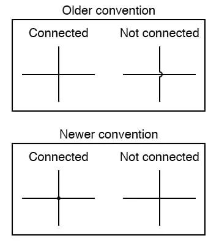

Source: “All about Circuits” [EE Reference](https://www.allaboutcircuits.com/textbook/reference/chpt-9/wires-and-connections/)

To get rid of the ambiguity, Martina decided to add a “jump” in the intersection point for the bypassing wires but couldn’t find how, so she [went to the Miro community forum](https://community.miro.com/ask-the-community-45/electrical-schemes-with-miro-12047) to ask.

She was by far not alone. The “Line jumps” and [its variations](https://community.miro.com/ideas/visual-treatment-for-when-connector-lines-overlap-and-need-to-hop-2240) had been [one of the most upvoted ideas](https://community.miro.com/ideas/connection-lines-add-a-jump-for-lines-that-cross-8223) in the Miro Community’s Wish list, and the community members were actively sharing their workarounds (and a fair amount of frustration) with each other.

Seemingly a minor detail, line jumps were so important that our users emulated them in amazingly creative ways. My personal favourites, in no particular order, are:

- Adding additional waypoints to guide a line around the intersection point 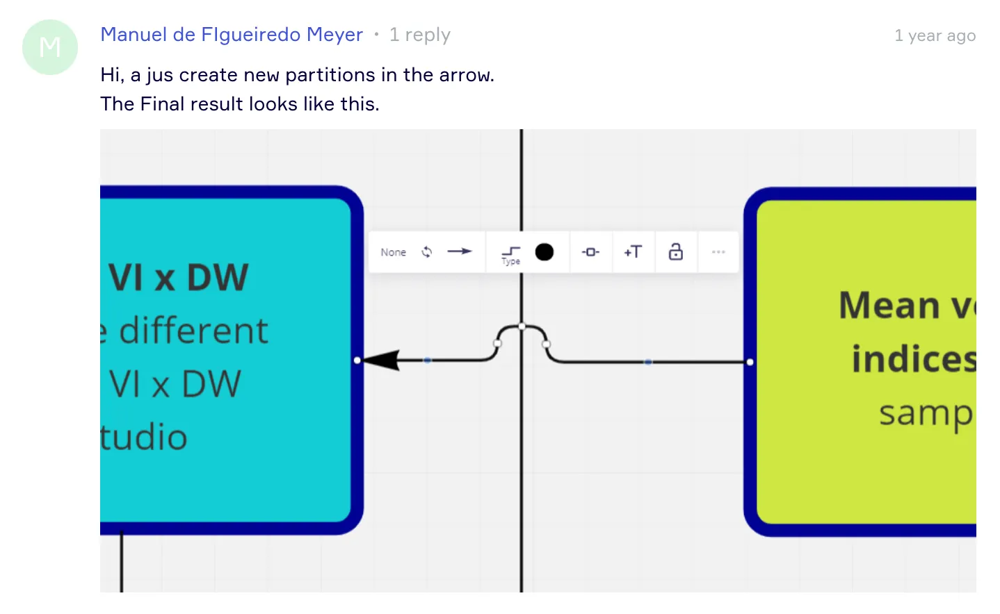
- Draw a circle outline and a rectangle filled with background color on top. 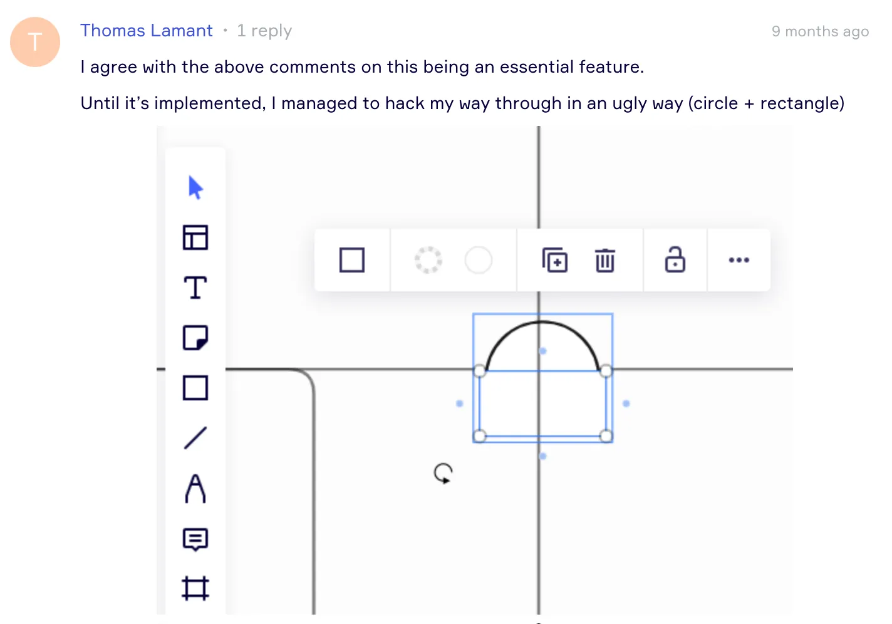
- Use two connector lines and a transparent shape in the intersection point 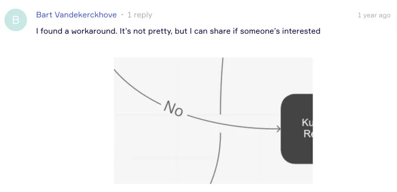
- Add a text label with invisible Unicode characters and place it at the intersection point (looks essentially the same as the one above).

That’s the power of Miro: unleashing the flow of creativity!

Marketing nonsense aside, emulation of such a basic feature is annoying manual labour that could be avoided if we at Miro had just implemented “Line Jumps” natively. But we hadn’t, though the users wanted it badly:

> Line jumps are essential for directional flow […] Please get this feature added, it’s so necessary!
— Martha

> Imperative feature for process designers. I’ve gone back to draw.io to complete our more advanced processes.
— ksumm

> this is so important to network diagrams …. without this, the level of ambiguity in any non-trivial diagram is too high to be useful. It will absolutely drive me back to other tools.
— Ben

> Man, I’d kill for this functionality in Miro.
— Brian

Please don’t kill anyone, Brian! We’ve implemented it and, possibly, saved a life or two.

## Project planning

It was a chill summer day when our team (Diagramming) didn’t have a big ongoing project and the leadership was figuring out the future strategy for our stream. In other words, it was perfect time to act on small annoying problems like this one. Our product manager Emil brought us the most urging feature requests from user interviews, from Miro Community and from sales. We, engineers, gathered on a call to read them through and roughly estimate in T-shirts. As you can guess, one of those features happened to be line jumps.

Some of us were not convinced that the line jumps were worth taking in or even possible given the performance issues potentially caused by the number of line intersections, given the complexity of the connector line code and the amount of legacy in its implementation. Another major objection was that our team had owned the line for only a month or two by then, which is practically nothing for such a big, complex, multi-layered widget. Some of us argued that there were lower hanging fruits that would bring us the same value. They all were fair points. And, nevertheless…

Sveta hacked a prototype the next day. A perfect way of figuring out whether the thing is possible or not. To discover problems you did not think of. To learn the codebase in a pace no documentation can possibly provide. And, above all, it’s fun. Even if by prototyping you find out the task was not possible, it’s still worth it. But in our case, it turned out possible. Sveta showed us a working demo.

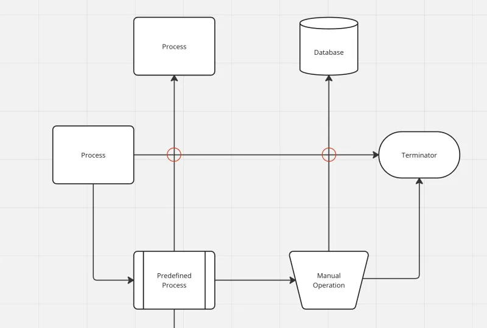

First prototype of the line intersection detector

We all were immediately convinced. Yes, we saw just red circles rather than proper visuals. Yes, they were not updated each in real time but all at once on end of editing, and, yes, they were implemented in the dirtiest way possible with a godlike object storing all the lines on the board and iterating through them in quadratic time on update. It was not the point. We knew the line jumps were feasible to implement in a reasonable time, and we could figure the other details out later.

On the next sprint grooming we discussed our findings with our EM and PM. Our designer had already had some design mock-ups prepared, so we were unblocked to have a proper project kick-off. At its outcome, we decided to dedicate a team of one developer working on it full-time and two others stepping in from time to time. With such a workforce we defined a time box of two sprints (4 weeks) taking into account vacations and sick leaves, like adults do. We defined critical features and optional ones. We had all in place to get it started, and I volunteered to lead the project development.

## Engineering kick-off

Every task is small until you look at it close enough. Line jumps definitely seemed small. Gotten used to the hybrid work, we arranged a Zoom call with the subteam dedicated for line jumps and Sveta who volunteered to help and share her insights from prototyping. On the call, we realised that we all were in the same building, sitting in different meeting rooms. The situation seemed ridiculous, so two minutes fast-forward we were all brainstorming in the same meeting room next to a non-virtual whiteboard.

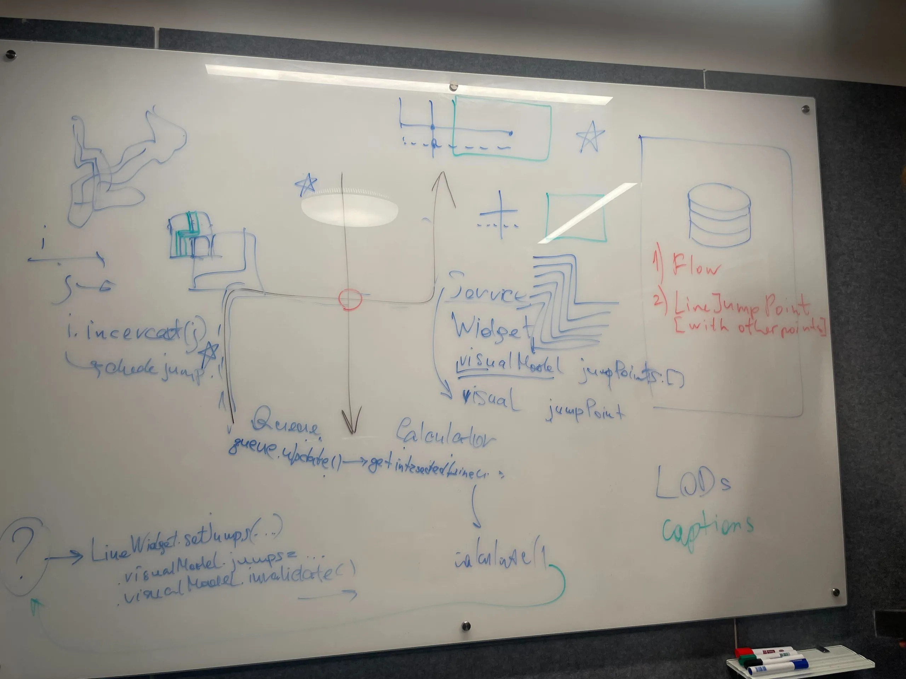

Tribute to [Jean-Michel Basquiat](https://www.moma.org/artists/370) by Diagramming team

The number of questions to resolve was growing so fast that we barely kept up writing them down. Just to give you an impression, here are some of the UI/UX questions we now had to address:

- Enable line jumps as a global setting or per every line?
- Where this setting should be placed?
- Should we use levels of detalization for different zoom levels?
- How should jumps over thick lines look like?
- How do two line intersections look if they are very close to each other?
- How should a line jump look like if it’s close to a line bend or its end?
- Take two lines intersecting each other with a very acute angle. Does it still make sense to show a line jump?
- Do the jumps have to be updated in real time as you move line?
- Do we need to implement jumps over curve lines or only straight?
- How should a line jump behave next to a line caption (text on a line)
- Should the jumps be enabled by default?

The list is by far not exhaustive, and concerns only functional requirements. There were also non-functional, like

- Accessibility requirements: line jump size, UI elements enabling
- Performance requirements: how many line jumps on a board we want to support? How many inside the viewport?
- Architectural considerations: what is the data model, where is it stored, where to locate the business logic?

And some less obvious functional requirements to keep in mind:

- supporting export to PNG, JPG, PDF
- enable jumps via [Miro WebSDK](https://developers.miro.com/docs/miro-web-sdk-introduction)
- enable jumps via [Miro Rest API](https://developers.miro.com/docs/work-with-connectors)

There were other questions farther from the code implementation:

- Should we release it on its own or in pack with other line improvements?
- Marketing communications: how do we announce the feature, who does that?
- Tutorials: what tutorials need to be updated, who does that?
- Miro templates: do we need to update any? Who does that?

Certainly, Miro has dedicated people to address most of these questions but we at least needed to make sure those people all were aware of us needing them to solve those questions.

Thus, one deeper look revealed the whole iceberg below an initially seemingly small task. We knew that we needed to treat it as a project worth careful grooming and maybe even scope cut. Not great but way better than finding it out amid the implementation phase.

## Implementation

Software engineering is all about making decisions, and the more senior you become as an engineer, the more complicated the decisions become. You learn more ways of doing the same thing, you start seeing consequences of the compromises you made years ago. You face dirty pieces of legacy code that are bound to be there forever, and you watch beautiful technical solutions being abandoned because they did not reach product requirements or were released too late. You reflect on it all, and you learn from it. Then, of course, you fail again, but with more elegance 💃

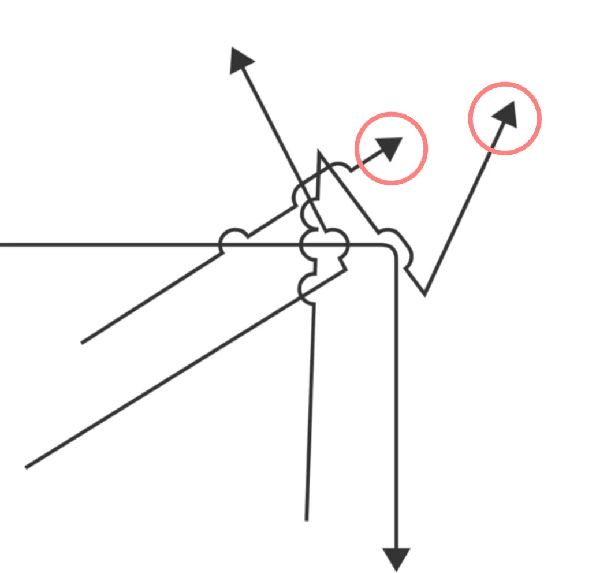

## LineJumpCalculator

There was a problem. Line, just as any other board object in Miro, is an independent entity unaware of other objects. This way it can be packaged, loaded lazily, well tested, et cetera. Isolation is good. However, in order to display a jump, line has to know where it intersects another line. Therefore, it should have some information about other lines and some logic in place to check whether it intersects them. But then we would lose the independence of each line. Not good. So we decided to have an external entity able to take any lines on the board and check some of them for intersections. That was the conception of `LineJumpCalculator`.

Solution:

1. Line provides an API to set line jump positions from outside, so it could display them.
2. Each line edit calls LineJumpCalculator to recalculate.
3. LineJumpCalculator takes the changed lines, iterates over all other lines on board and checks for intersections with the changed ones.
4. After all intersections for a line are collected, call its API to set line jumps.

Sounds okay for the first iteration. Probably it’s too much to check all other lines, but we can optimise it later. In general, it should work fine, right? Or not? Do you see a flaw in this logic? We didn’t!

Boom! Jumps don’t disappear when they should. The algorithm included in the calculation only lines that are updated and, from all lines on the board, only the ones intersecting them, and call line jump recalculation only for them. The ones that used to be intersected before edit but are not anymore, were not included.

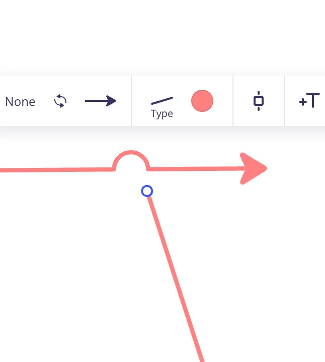

Boom (2)! Jumps are updated only for the lines you edit, so if the jump was displayed on the other line, it would not update.

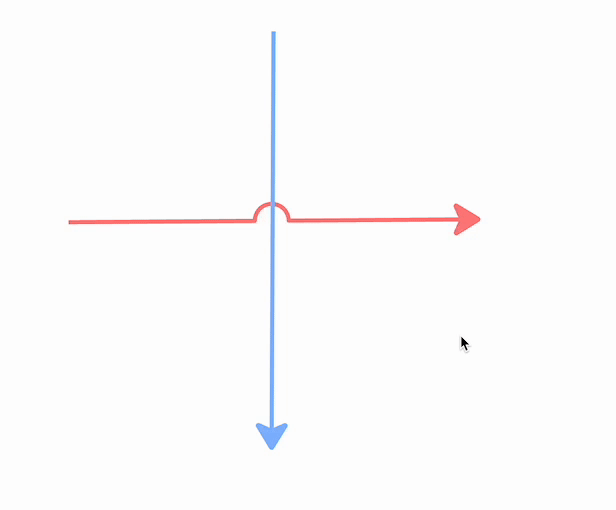

At this point we just temporarily stepped back to square-time algorithm and added a `todo: n², optimise` to unblock further development. At least it worked.

Later we implemented a nice logic triggering jump recalculation only for the lines you edit and the lines it intersected before edit. The rest we just don’t touch. Works fast and looks beautiful but the story is boring.

## QuadTree

Our QA engineer Anna quickly found a moderately-sized board where line jumps were causing visible performance problems. We already knew the root cause even before taking a look at the board. Quadratic time complexity of the line intersection testing. Yes, we perform the intersection point calculation only if their bounding boxes intersect, but before that we need to check intersection of every line’s bounding box with every other line’s bounding box. It turned a board with 300+ lines into a laptop-heater making 100k comparisons on every mouse move. Steps to reproduce were easy:

1. Select all
2. Drag around

Luckily, a sibling team had already implemented a QuadTree structure storing all board objects sizes and positions mapped to tiles.

QuadTree is a data structure recursively partitioning two-dimensional space in quadrants. If a quadrant has at least four children, they get divided into smaller quadrants, and so forth until every node has no more than four children in total.

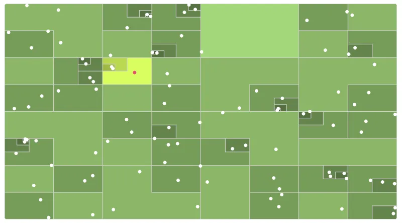

Source: [An interactive explanation of quadtrees](https://jimkang.com/quadtreevis/) by Jim Kang

the benefit is that you can search objects by location in logarithmic time. The drawback is that you have to re-build this structure every time an object is added, removed or moved.

In our case adopting QuadTree meant that updating 300 lines at once caused 300*log4(300) = 1200 intersection detections instead of 90,000 essentially turning lagging freezing hurting hell into a lovely smooth experience. Not bad, huh?

Next question is: how do we know if we’ve optimised it enough? Should it be 300 or 1000 lines working fine so that we can say “it’s optimised enough”? The answer was 5000. This is what the dedicated performance team told us.

So we went further and added more optimisations. For instance, before looking for intersections, we first check for overlap of the pre-calculated bounding boxes of the lines. If they don’t overlap, we know the lines don’t intersect and continue to the next line.

## Intersections with curve lines

This one is my favourite. We had spent some time with the squad discussing whether or not we needed to show jumps on top of curved lines as well. As part of an investigation, Aleksey chose a nice intersection calculation algorithm and created a good working prototype:

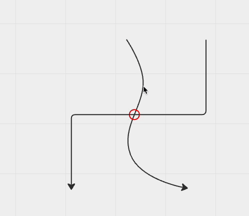

But I still insisted that we didn’t need to do that because, I said:
- it’s not really a diagramming use case. Curve lines are rarely used in diagramming compared to other line types,
- we’ll spend on it time that we could have spent on something more important,
- we’ll introduce additional complexity,
- it might impact performance.

So, after all, we decided to scope it out, at least for the internal release.

You guessed it right. On the day of the release we get a report: jumps don’t work. We’re checking the video attached to the report. Yes, there was an intersection with a curve line and the user expected them to work. We explain that, hey, we don’t support curve line intersections yet because this and that. But the next day, we get another report. And one more the next day.

I had to admit, I was wrong. We needed to fix it. But how? Who should do that? What else should we sacrifice in order to take it in? All these questions remained unanswered when the same evening Andrei sent me a Slack message: I’ve fixed the lines, and you’re not gonna believe how.

The fix was, indeed, umm, well, let me better just show it.

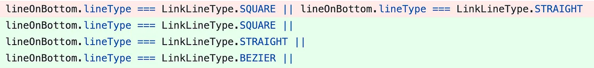

We sat on a treasure chest all this time without knowing it. Our curve lines had already had the pre-computed segment data that is precise enough to approximate an intersection point. It was just us not knowing it was there.

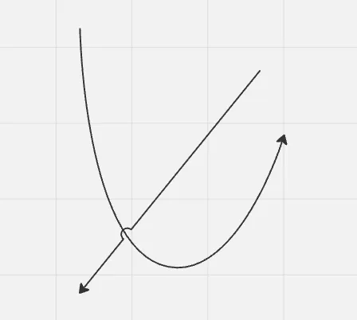

Suprematist composition #3. Andrei K., canvas, Miro, 2023

+1 line, -1 problem. 🥷

## Release

We had a reasonable number of bug reports and design feedback, but the general reception was warm, sometimes even borderline hot.

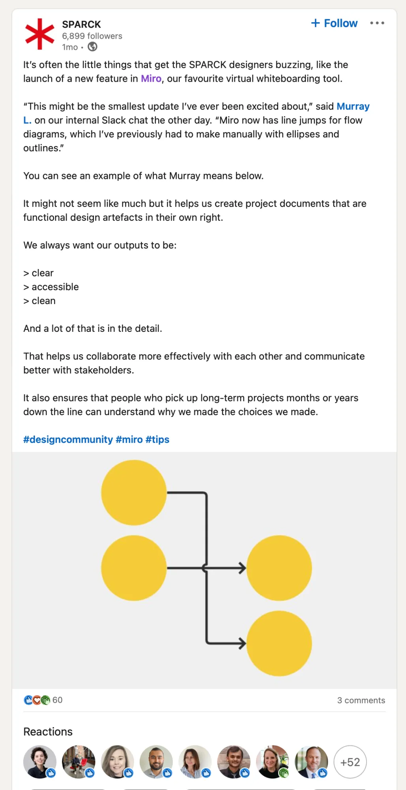

## Conclusion

There is a unique set of skills and knowledge you can acquire only leading projects. At the very least, it makes you a better engineer as you start being more considerate of the business side of things. You see first-hand who stakeholders are, and why do they hold their stakes. You realise why some things that appear important don’t ever get done as you yourself have to make decisions not to do some things. You see how much small details turn out to matter: the jumps close to one another, next to a bend, intersections of lines with a very acute angle… all these things you don’t think about until you do. And then you make them work as intended together. That’s the beauty of engineering.

_This article was originally published on [Miro Engineering](https://medium.com/miro-engineering/) blog on Medium._