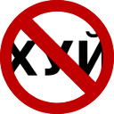

> Оригинал написан для Хабра, но через полчаса после публикации модераторы выпилили статью и попросили убрать мат. Я убрал, и статья стала говном. Но, к счастью, за те полчаса, что статья успела провисеть, куча ворующих контент говносайтов скопировала её себе в первозданном виде, и благодаря этому спустя много лет я смог её восстановить.

Почему вокруг так много матерятся? Одно дело, когда на ногу падает молоток, или когда надо срочно сообщить коллеге, что он не успевает сделать макет сайта. Но в Интернете-то у автора всегда должно быть достаточно времени, чтобы подобрать красивую фразу и показать себя грамотным интеллигентным человеком с большим словарным запасом. К сожалению, редок тот случай, когда обсценная лексика действительно уместна — навскидку, один на сотню.

Некоторые владельцы форумов, чатов и блогов борются с обилием мата организационными мерами (устанавливая правила) или техническими (используя парсеры), но самый большой недостаток существующих антимат-систем — это многочисленные ложные срабатывания, порождающие удивительные неологизмы вроде заштричлен, застрапенис и скигей (кто не догадался — в оригинале было слово «скипидар»). Также скрипты (а зачастую — и сами авторы текстов) иногда заменяют буквы из середины бранных слов на звёздочки (***) или символы "#$%^", из-за чего у меня возникает подозрение, что у этих людей вместо половых органов чёрные квадратики.

Мы пойдём иным путём: пусть читатель сам решает, что он хочет видеть на экране: красочный русский мат или не менее красочный литературный русский язык. Мы разработаем расширение для браузера, заменяющее ненормативную лексику на синонимичные литературные выражения. Основным и решающим требованием к расширению является естественность и читабельность текста после замены. Мы не хотим обеднять язык, просто изымая из него мат — мы обогащаем его, предлагаем взамен нечто большее.

В статье я провожу поверхностное лингвистическое исследование русского мата, а также даю краткий курс регулярных выражений в JavaScript и руководство по созданию расширений для браузера Chrome.

## Лингвистика. Русский мат по полочкам

В русском языке есть три основных словообразующих матерных корня: хуй, пизд, еб, и несколько слов, изначально не являвшихся матерными, но в современном языке находящихся под табу: *муди, блядь, говно, педераст (производные — пидор, пидорас), кондом (пр. — гондон, гандон)* и другие. Слово «хуй» является наиболее продуктивным в плане словообразования словом русского мата и, вероятно, самым богатым на словоформы и производные слова в русском языке вообще. Также интересен тот факт, что выражения, образованные от слова «хуй», покрывают практически все семантические поля языка. А для меня, как для разработчика, это означает, что в разном контексте эти выражения придётся заменять на разные аналоги.

Напомню, что слово в русском языке может включать в себя следующие морфемы: приставка, корень, интерфикс, суффикс, окончание. Для тех, кто не знает, интерфикс — часть слова, связывающая два или более корней (применительно к теме статьи — ху**е**плёт, осл**о**ёб). Обязательным является наличие как минимум одного корня в слове, остальное — опционально.

Уникальной особенностью русского мата является то, что изменение одной морфемы (например, приставки) может кардинально изменить семантику слова. Пример: лексемы *наебать, съебать, въебать, выебать, подъебать, заебать, разъебать, проебать* относятся к различным семантическим полям. Более того, даже слова с *одной и той же приставкой* (или без неё) могут нести разную смысловую нагрузку в зависимости от суффиксов, стоящих после корня.

Примеры:

* въебать / въёбывать;
* выебать / выёбываться;
* уебать / уёбывать;
* ебать / ебашить;

Окончание никак не влияет на семантику, а служит лишь для обозначения отношения слова к другим членам предложения.

Всего русский язык насчитывает 70 приставок, 20 из которых — заимствованные из греческого и латинского языков (экс-, пост-, гипер-, и т.д.), а 50 — исконно русские. Заимствованные приставки с матерными словами не употребляются, либо употребляются, но настолько редко, что этим можно пренебречь. Заметим также, что каждый из рассматриваемых корней употребляется не со всеми существующими русскими приставками (к примеру, корень еб не употребляется с приставками воз-, через-, и некоторыми другими), что значительно сокращает количество существующих комбинаций приставка-корень. Аналогично отсеиваются многие суффиксы.

Ввиду большой разницы в семантике слов и словосочетаний, образованных из нецензурных корней с помощью различных приставок и суффиксов, каждое выражение нужно рассматривать в отдельности. Для поиска и замены мощных языковых конструкций мы будем использовать мощный инструмент — регулярные выражения.

## Регулярные выражения
В общей сложности в текущей версии расширения получилось около 100 регулярных выражений, многие из которых похожи друг на друга, так что, приводить их все считаю бессмысленным. Подробно рассмотрю лишь некоторые шаблоны, но этого будет вполне достаточно, чтобы проиллюстрировать использование регулярок в JS вообще и мой ход мысли в данном конкретном случае. Полный исходник вы можете увидеть [на GitHub](https://github.com/oshibka404/antimat). Принимаю пулл реквесты, с нетерпением жду багрепортов и фичреквестов.

### Введение в регулярные выражения
Регулярные выражения в JavaScript работают через специальный объект RegExp. Краткая запись регулярного выражения имеет следующий синтаксис:

```
/выражение/флаги
```

В самом простом случае между слешами может стоять набор жёстко заданный набор символов. Например:

```js
/Пиздец/
```

Такая конструкция найдёт все вхождения подстроки «Пиздец» в тексте. Важно: **регистр имеет значение**, то есть, строку «пиздец» такое выражение уже не найдёт. Чтобы не учитывать регистр символов, нужно использовать флаг `i`:

```js
/пиздец/i
```

Такая конструкция уже соответствует всем вхождениям строк «Пиздец», «пиздец», «ПИЗДЕЦ» и «ПиЗдЕц».

Мы, конечно же, хотим, чтобы все предложения в обработанном тексте начинались с заглавной буквы, а слова внутри предложения — со строчной. Поэтому мы последовательно применим к тексту оба регулярных выражения, заменив их на одно из синонимичных и столь же эмоционально окрашенных выражений:

```js
text = text.replace(/Пиздец/g, randomWord(["Ужас", "Кошмар"]));
text = text.replace(/пиздец/i, randomWord(["ужас", "кошмар"]));
```

Метод строкового объекта `replace()` принимает два аргумента:

1. Регулярное выражение или искомая подстрока — шаблон, по которому будет производиться поиск в документе;
2. Строка (или функция, возвращающая строку), которой будут заменены все вхождения шаблона

На первый взгляд наилучшей заменой слову «Пиздец» будут слова «Коллапс», «Апокалипсис» или «Безысходность». Однако, в предложениях, где словом «Пиздец» подчёркивается крайняя, наивысшая степень какого-либо чувства или свойства, они будут выбиваться из контекста, а слова «Ужас» и «Кошмар» — нет. Например: «Я пиздец как хочу домой», «Эта статья просто пиздец какая длинная». Согласитесь, «Я кошмар как хочу домой» — выглядит нормально, «Эта статья просто ужас какая длинная» — тоже, а «Я коллапс как хочу домой» — нет.

Важный момент: необходимо подбирать синонимы, которые склоняются так же, как и исходное слово. «Кошмар» склоняется очень редко, но всё же бывает: «Это не иконки, а пиздецы какие-то» будет заменено на «Это не иконки, а ужасы какие-то».

Рассмотрим более сложный случай, когда слово имеет несколько словоформ, которые описывают одно и то же состояние/явление/объект. Например, выражение удивления «охуеть». Часто в схожем значении используется форма «прихуеть». Семантически, «прихуеть» — это то же самое, что «охуеть», только чуть менее ярко выраженно. Также распространена нарочито неграмотная форма «ахуеть». Мы специально берём во внимание глагол только в инфинитиве, так как в личных формах «охуеть» часто используется как заявление о наглости или беспринципности объекта речи («Вы охуели что ли?», «Да они там все охуели!»).

Пишем:
```js
text = text.replace(/(О|А|При)хуеть/g, "С ума сойти");
text = text.replace(/(о|а|при)хуеть/i, "с ума сойти");
```
Конструкция вида `(A|B)C` соотвествует подстрокам `AC` и `BC`. С помощью вышеприведённых строчек кода мы находим все вхождения подстрок «Охуеть», «Ахуеть», «Прихуеть», а затем — делаем то же самое, но без учёта регистра.

Конструкцию `(A|B)` можно использовать сколько угодно раз, на любом уровне вложенности и в любой части выражения. Рассмотрим это на ещё чуть более сложном примере с множественными суффиксами и чередованием в корне: распространённое наречие: «хуёво». Это слово имеет огромное количество суффиксных производных: «хуевасто», «хуёвенько» и даже «хуевастенько». Помимо смены суффикса мы наблюдаем здесь чередование е/ё в корне. Также стоит учитывать, что «ё» на письме часто заменяется буквой «е». Составим регулярное выражение, учитывающее все эти формы:

```js
/Ху(ё|е)в(аст|)(еньк|)о/
```
и произведём соответствующую замену:
```js
text = text.replace(/Ху(ё|е)в(аст|)(еньк|)о/g, randomWord(["Плохо", "Печально", "Ужасно", "Кошмарно", "Уныло"]));
text = text.replace(/ху(ё|е)в(аст|)(еньк|)о/i, randomWord(["плохо", "печально", "ужасно", "кошмарно", "уныло"]));
```
Аналогично, но учитывая возможные окончания поступим с прилагательным «хуёвый» — негативным оценочным суждением по отношению к качеству объекта речи:

```js
text = text.replace(/Ху(ё|е)в(аст|)(еньк|)(ы(й|х|е|м)|о(е|го|й|му)|ая|ий)/g, "Низкого качества");
text = text.replace(/ху(ё|е)в(аст|)(еньк|)(ы(й|х|е|м)|о(е|го|й|му)|ая|ий)/i, "низкого качества");
```

Путём нехитрого сложения и умножения мы можем сосчитать, что приведённое в примере регулярное выражение

```js
/Ху(ё|е)в(аст|)(еньк|)(ы(й|х|е|м)|о(е|го|й|му)|ая|ий)/
```
может найти 80 возможных форм слова.

Двигаясь дальше, возьмём для примера наречие, выражающее безразличие: «похуй». Оно часто употребляется в формах «похуй», «похую», иногда — «по хуй», «по хую», «по хуям». То есть, иногда пишется слитно, иногда раздельно.

Для того, чтобы указать в регулярном выражении, что в некотором месте может стоять пробельный символ, либо вообще ничего, можно использовать конструкцию `(s|)`. Здесь в уже знакомой нам конструкции `(A|B)` в качестве А указан спецсимвол `s`, указывающий на пробельный символ, а в качестве B не указано ничего. Вместо этого можно использовать конструкцию `s?`, где спецсимвол? указывает на то, что элемент, стоящий перед ним, может присутствовать, а может и отсутствовать.

Составляем регулярное выражение и производим замену:

```js
text = text.replace(/(По(s|)ху(й|я|ям|ю))/g, randomWord(["Неважно", "Индифферентно", "Безразлично"]));
text = text.replace(/(по(s|)ху(й|я|ям|ю))/i, randomWord(["неважно", "индифферентно", "безразлично"]));
```

Если мы хотим найти и заменить слово «хуй» в значении «пенис», то мы должны сделать это так:

```js
text = text.replace(/(s|^)Хуй/g, randomWord([" Пенис", " Член", " Детородный орган"]));
text = text.replace(/(s|^)хуй/i, randomWord([" пенис", " член", " детородный орган"]));
```
спецсимвол `^` означает начало входных данных. Таким образом, мы находим слово «Хуй», идущее после пробела или в самом начале обыскиваемой строки.

## Расширение Google Chrome
Расширение будет состоять из трёх основных частей:

обязательный файл манифеста `manifest.json`, в котором описаны основные параметры расширения;
собственно, javascript-файл, который будет выполнять всю работу;
Иконки размера 128х128, 64х64 и 16х16;
Манифест прост донельзя.

```json
{
	"manifest_version": 2,
	"name": "У нас не матерятся",
	"version": "1.0",
	"icons": { "16": "icon32.png",
           "48": "icon128.png",
          "128": "icon128.png" },
	"description": "Заменяет нецензурную брань на синонимичные литературные выражения.",
	"content_scripts": 
	[
		{
			"matches": ["*://*/*"],
			"js": ["content_script.js"],
			"run_at": "document_end"
		}
	]
}
```

О синтаксисе лучше всего узнать всё, что надо, из [первоисточника](https://developer.chrome.com/extensions/manifest.html).

Иконку я нарисовал также не блещущую оригинальностью:



Скрипт запускается сразу после загрузки страницы (мы явно указали в манифесте `"run_at": "document_end"`), его тело состоит из трёх функций:

* `walk(node)` — функция, осуществляющая рекурсивный обход нодов HTML-документа. Если принятый ею нод содержит текст, она передаёт нод в функцию `makeItCultural()`;

* `makeItCultural(textNode)` — функция, осуществляющая замену подстрок по шаблонам согласно регулярным выражениям. В случае, если существует несколько вариантов замены, эти варианты передаются в виде массива в функцию `randomWord()`;

* `randomWord(words)` — функция, принимающая массив и возвращающая его случайный элемент;

На странице `chrome://extensions/` ставим галочку «Developer mode», жмём кнопку «Load unpacked extension...» и выбираем папку с нашим расширением. После этого тестируем его, правим, после каждой правки не забываем нажать на ссылку Reload возле нашего расширения.

Чтобы опубликовать расширение в Webstore, нужно заплатить 5 долларов. Вообще, весь этот процесс отлично описан в [другой хорошей статье на Хабре](http://habrahabr.ru/post/170765/), так что, не вижу смысла повторяться.

## Заключение
Получившееся в итоге расширение заставляет играть новыми красками ЖЖ Артемия Лебедева и интервью Сергея Шнурова, но ему пока не по зубам Большой Петровский Загиб (ссылку приводить не буду — погуглите сами, оно того стоит). Тема русского мата бесконечно глубока и по ней написан не один десяток академических работ. Однажды физики докажут (или опровергнут) теорию струн, инженеры построят персональные квантовые компьютеры, у каждого встречного в кармане будет гаджет, питающийся от холодного ядерного реактора, а русский мат так и не будет изучен до конца.

Постарался написать максимально доступно, так, чтобы было понятно и нескучно всем читателям, а получилось как обычно — для школьников младших и средних классов, сидящих на героине.

Готовое расширение можно установить из [Chrome Webstore](https://chrome.google.com/webstore/detail/у-нас-не-матерятся/dcomedbpmmeeajabeeepfajinnigagai), исходники найти на [GitHub](https://github.com/oshibka404/antimat).

## Список источников
[Javascript.ru — Регулярные выражения](http://javascript.ru/basic/regular-expression);
[Chrome Web Store — Google Developers](https://developers.google.com/chrome/web-store/)
[Алексей Плуцер-Сарно. Большой словарь мата, Том I и Том II](http://plutser.ru/)
