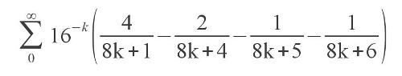

С недавних пор существует элегантная формула для вычисления числа Пи, которую в 1995 году впервые опубликовали Дэвид Бэйли, Питер Борвайн и Саймон Плафф



Казалось бы: что в ней особенного — формул для вычисления Пи великое множество: от школьного метода Монте-Карло до труднопостижимого интеграла Пуассона и формулы Франсуа Виета из позднего Средневековья. Но именно на эту формулу стоит обратить особое внимание — она позволяет вычислить n-й знак числа пи без нахождения предыдущих. За информацией о том, как это работает, а также за готовым кодом на языке C, вычисляющим 1 000 000-й знак, прошу под хабракат.

Как же работает алгоритм вычисления N-го знака Пи?
К примеру, если нам нужен 1000-й шестнадцатеричный знак числа Пи, мы домножаем всю формулу на 16^1000, тем самым обращая множитель, стоящий перед скобками, в 16^(1000-k). При возведении в степень мы используем [двоичный алгоритм возведения в степень](http://brtrg.com/blog/post/514) или, как будет показано в примере ниже, [возведение в степень по модулю](https://en.wikipedia.org/wiki/Modular_exponentiation). После этого вычисляем сумму нескольких членов ряда. Причём необязательно вычислять много: по мере возрастания k 16^(N-k) быстро убывает, так что, последующие члены не будут оказывать влияния на значение искомых цифр. Вот и вся магия — гениальная и простая.

Формула Бэйли-Борвайна-Плаффа была найдена Саймоном Плаффом при помощи алгоритма [PSLQ](http://www.cecm.sfu.ca/organics/papers/bailey/paper/html/node3.html), который был в 2000 году включён в список [Top 10 Algorithms of the Century](http://orion.math.iastate.edu/burkardt/misc/algorithms_dongarra.html). Сам же алгоритм PSLQ был в свою очередь разработан Бэйли. Вот такой мексиканский сериал про математиков.
Кстати, время работы алгоритма — O(N), использование памяти — O(log N), где N — порядковый номер искомого знака.

Думаю, уместно будет привести код на языке Си, написанный непосредственно автором алгоритма, Дэвидом Бэйли:

```c
/*  
    This program implements the BBP algorithm to generate a few hexadecimal
    digits beginning immediately after a given position id, or in other words
    beginning at position id + 1.  On most systems using IEEE 64-bit floating-
    point arithmetic, this code works correctly so long as d is less than
    approximately 1.18 x 10^7.  If 80-bit arithmetic can be employed, this limit
    is significantly higher.  Whatever arithmetic is used, results for a given
    position id can be checked by repeating with id-1 or id+1, and verifying 
    that the hex digits perfectly overlap with an offset of one, except possibly
    for a few trailing digits.  The resulting fractions are typically accurate 
    to at least 11 decimal digits, and to at least 9 hex digits.  
*/

/*  David H. Bailey     2006-09-08 */

#include <stdio.h>
#include <math.h>

int main()
{
  double pid, s1, s2, s3, s4;
  double series (int m, int n);
  void ihex (double x, int m, char c[]);
  int id = 1000000;
#define NHX 16
  char chx[NHX];

/*  id is the digit position.  Digits generated follow immediately after id. */

  s1 = series (1, id);
  s2 = series (4, id);
  s3 = series (5, id);
  s4 = series (6, id);
  pid = 4. * s1 - 2. * s2 - s3 - s4;
  pid = pid - (int) pid + 1.;
  ihex (pid, NHX, chx);
  printf (" position = %i\n fraction = %.15f \n hex digits =  %10.10s\n",
  id, pid, chx);
}

void ihex (double x, int nhx, char chx[])

/*  This returns, in chx, the first nhx hex digits of the fraction of x. */

{
  int i;
  double y;
  char hx[] = "0123456789ABCDEF";

  y = fabs (x);

  for (i = 0; i < nhx; i++){
    y = 16. * (y - floor (y));
    chx[i] = hx[(int) y];
  }
}

double series (int m, int id)

/*  This routine evaluates the series  sum_k 16^(id-k)/(8*k+m) 
    using the modular exponentiation technique. */

{
  int k;
  double ak, eps, p, s, t;
  double expm (double x, double y);
#define eps 1e-17

  s = 0.;

/*  Sum the series up to id. */

  for (k = 0; k < id; k++){
    ak = 8 * k + m;
    p = id - k;
    t = expm (p, ak);
    s = s + t / ak;
    s = s - (int) s;
  }

/*  Compute a few terms where k >= id. */

  for (k = id; k <= id + 100; k++){
    ak = 8 * k + m;
    t = pow (16., (double) (id - k)) / ak;
    if (t < eps) break;
    s = s + t;
    s = s - (int) s;
  }
  return s;
}

double expm (double p, double ak)

/*  expm = 16^p mod ak.  This routine uses the left-to-right binary 
    exponentiation scheme. */

{
  int i, j;
  double p1, pt, r;
#define ntp 25
  static double tp[ntp];
  static int tp1 = 0;

/*  If this is the first call to expm, fill the power of two table tp. */

  if (tp1 == 0) {
    tp1 = 1;
    tp[0] = 1.;

    for (i = 1; i < ntp; i++) tp[i] = 2. * tp[i-1];
  }

  if (ak == 1.) return 0.;

/*  Find the greatest power of two less than or equal to p. */

  for (i = 0; i < ntp; i++) if (tp[i] > p) break;

  pt = tp[i-1];
  p1 = p;
  r = 1.;

/*  Perform binary exponentiation algorithm modulo ak. */

  for (j = 1; j <= i; j++){
    if (p1 >= pt){
      r = 16. * r;
      r = r - (int) (r / ak) * ak;
      p1 = p1 - pt;
    }
    pt = 0.5 * pt;
    if (pt >= 1.){
      r = r * r;
      r = r - (int) (r / ak) * ak;
    }
  }

  return r;
}
```

Какие возможности это даёт? Например: мы можем создать систему распределённых вычислений, рассчитывающую число Пи и поставить всем Хабром новый рекорд по точности вычисления (который сейчас, к слову, составляет 10 триллионов знаков после запятой). Согласно эмпирическим данным, дробная часть числа Пи представляет собой нормальную числовую последовательность (хотя доказать это достоверно ещё не удалось), а значит, последовательности цифр из него можно использовать в генерации паролей и просто случайных чисел, или в криптографических алгоритмах (например, в хэшировании). Способов применения можно найти великое множество — надо только включить фантазию.

Больше информации по теме вы можете найти в [статье самого Дэвида Бэйли](http://www.experimentalmath.info/bbp-codes/bbp-alg.pdf), где он подробно рассказывает про алгоритм и его имплементацию;

И, похоже, вы только что прочитали первую русскоязычную статью об этом алгоритме в рунете — других я найти не смог.
