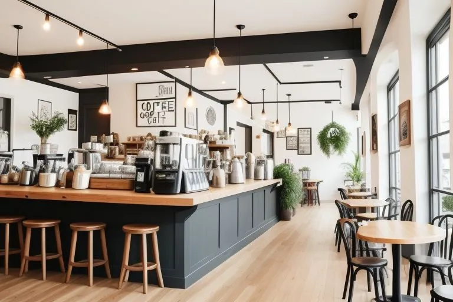
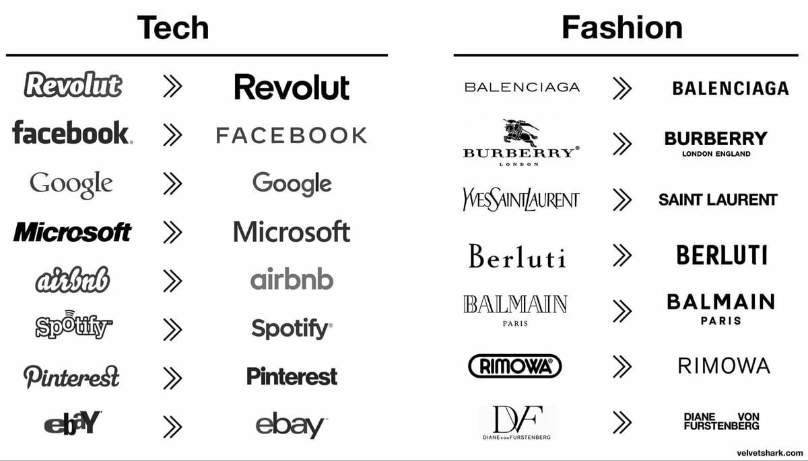
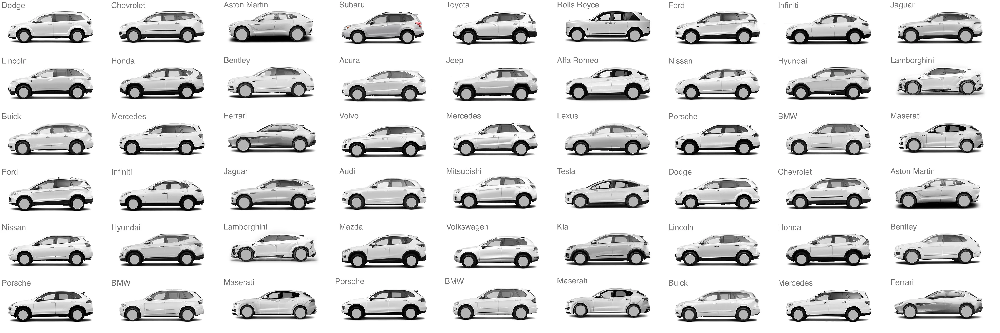
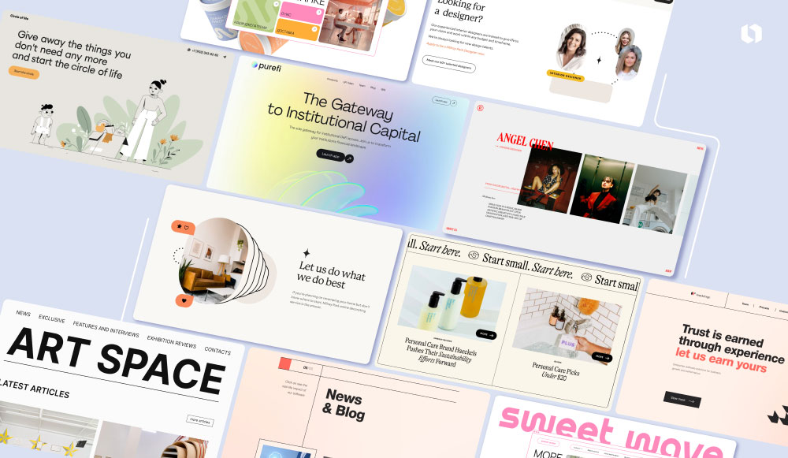
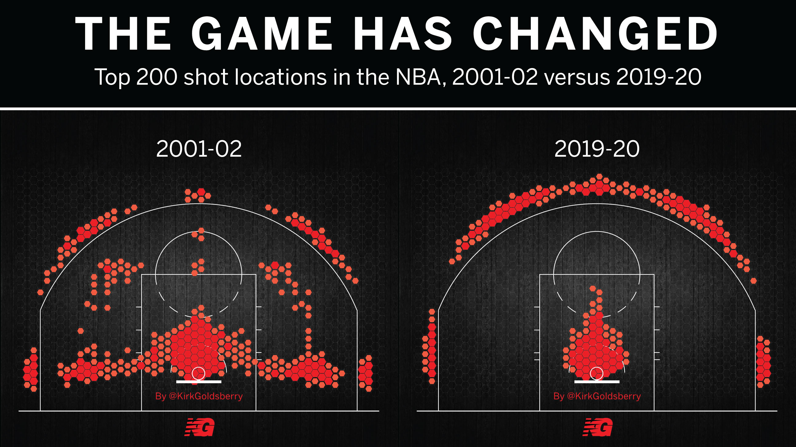
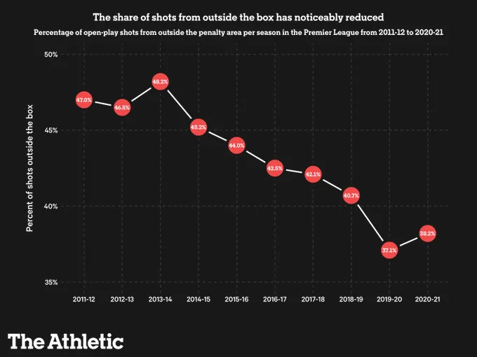

> Ты — это то, как ты сопротивляешься, и больше почти ничто
> — [Krovostok](https://genius.com/Krovostok-being-bad-lyrics)

If you live in Amsterdam, you’ve probably seen a coffee chain called [Cafecito](https://cafecito.nl/). Decent coffee, minimalist typographic logo, snowy-white walls, clean geometry of interior objects, perfectly lined up branded merchandise on wooden shelves. _I hate it_. It is less authentic than Starbucks on a train station. Cafecito is so outstandingly unremarkable that its facelessness feels to me like a personal insult.

This is not Cafecito, it’s AI-generated, but you get the point.

The concept and looks of Cafecito are the logical consequence of perfectly reasonable choices made by pragmatic designers, having every feature a coffee house has to have. Cafecito is a moodboard turned into life. All references were taken into account, analyzed and compiled. The result looks nice. One more time, I hate it.

I may dislike it as long as I like, but this generic minimalism is everywhere. Home interiors increasingly [look alike](https://www.instagram.com/fundamakeovers/). It’s perfectly reasonable to renovate your apartment this way: a one-style-fits-all [airspace](https://www.theguardian.com/commentisfree/2016/aug/06/hipster-aesthetic-taking-over-world) apartment is easier to sell or rent out. Both designers and home owners rather tolerate this style than enjoy it, but any other choice would probably mean money loss.

From “[The age of average](https://www.alexmurrell.co.uk/articles/the-age-of-average)” by Alex Murrell

Just like interiors, brand identics [have converged](https://www.bloomberg.com/opinion/articles/2020-09-07/welcome-to-your-bland-new-world-of-consumer-capitalism) into the same ersatz-style called [bland](https://www.bloomberg.com/opinion/articles/2020-09-07/welcome-to-your-bland-new-world-of-consumer-capitalism), serving the needs of the average consumer and no one in particular. Consumers gradually adapt their needs to the supply, only reinforcing the effect. [Cars look the same](https://www.roadandtrack.com/car-culture/a36715409/why-does-every-new-car-look-like-every-other-new-car/). [Advertising looks the same](https://eyeondesign.aiga.org/all-advertising-looks-the-same-these-days-blame-the-moodboard/). [Movie posters look the same](https://www.boredpanda.com/movie-poster-cliches/?utm_source=google&utm_medium=organic&utm_campaign=organic), and [the movies too](https://www.experimental-history.com/p/pop-culture-has-become-an-oligopoly). [Music sounds the same](https://towardsdatascience.com/hot-or-not-analyzing-60-years-of-billboard-hot-100-data-21e1a02cf304). [Sport teams play the same](https://www.theatlantic.com/newsletters/archive/2022/10/sabermetrics-analytics-ruined-baseball-sports-music-film/671924/).

One model that can help explain this consolidation is “linear city” and, specifically, [Hotelling’s law](https://en.wikipedia.org/wiki/Hotelling%27s_law). If two competing stores are independently choosing a place on a street, they will both end up next to each other, right in the middle. It works very literally: Burger King and McDonalds [tend to open next to one another](https://mindyourdecisions.com/blog/2012/10/23/why-are-mcdonalds-and-burger-king-usually-located-near-each-other-fast-food-location-game-theory/), despite that it’s bad for both businesses and for consumers. However, it’s a direct consequence of every actor’s rational decisions. It’s a micro-economic zugzwang: the situation is shit, but if you move first, you lose. Same happens in two-party political systems and, to a lesser degree, in all representative democracies: positions of political parties [become closer to each other](https://en.wikipedia.org/wiki/Median_voter_theorem) in an attempt to satisfy the median voter.

From “Driving Conformity” in “[User Zero](https://ade3.medium.com/driving-conformity-49ffb2b1ff9f)” by Adrian Hanft

Now to my personal web developer’s pet peeve. [Websites are all alike](https://www.fastcompany.com/90501691/science-confirms-it-web-sites-really-do-all-look-the-same). They are not really sites anymore. Browsing the Internet, there’s no sense of place in being on Facebook vs. Twitter, or on Medium vs. Substack, or on an insurance company’s website vs. a cosmetics brand. Visually, they have the same palettes, the same distances, and the same structure. The modern web turned into a network of [non-places](https://en.wikipedia.org/wiki/Non-place). It all looks like Cafecito now, and you know how I hate Cafecito.

Cover image for “[15 Website Design Trends You Don’t Want to Miss in 2024](https://looka.com/blog/website-design-trends/)” by Nisha on Looka

One can argue that visual aesthetics don’t matter that much, as the value of platforms is in their content, and I would agree, but the content is [also increasingly alike](https://qz.com/590581/everyone-has-the-same-personality-online). Tweets are following the same small bunch of patterns. LinkedIn lunatics post undistinguishable AI-generated inspirational nonsense. Instagram influencers not only [shot alike](https://www.instagram.com/insta_repeat/) and dress alike, they started [looking the same](https://www.vox.com/the-goods/2020/2/13/21125464/brow-lift-botox-bella-hadid-ariana-grande-kylie-jenner).

I guess what I’m trying to say is that what you refuse defines you more than what you conform. If you make all the same choices as everyone else, you naturally end up being like everyone else. If everyone is optimizing for the same metric, targeting the same audience, using the same methodology and the same toolkit, no wonder everyone gets the same results.

The effect will only intensify as long as more content is being generated with GenAI. The ultimate basic bitch, generative AI, can’t refuse by design, and is being reinforced with its own products. It will turn anything into Cafecito, you don’t even have to ask. Surprisingly, “Gen” in GenAI stands for “Generative,” not “Generic.”

Midjourney-generated images using the simplest possible text prompts by [Tim O’Neill](https://www.linkedin.com/posts/timoneill_the-age-of-average-a-great-article-by-activity-7044602177952108544-R5JC/) on LinkedIn

Another thing I’m trying to say is that “data-driven innovation” is an oxymoron. Data-driven change naturally gravitates toward local optimum.

It is the only good decision to go data-driven if “when everyone zigs, zag” doesn’t work. For example, if you’re trying to beat the opponent in a competitive zero-sum game, like in game sports or in fighting for customers in a saturated market, where the rules are clearly defined, so you either zig or lose.

Decresed diversity of NBA shot positions. By [Kirk Goldsberry](https://x.com/kirkgoldsberry/status/1217109175894831105/photo/1).

Even there, data-driven moneyballing made sportsmanship less art and more blue-collar job. As a result, watching sports sucks, individual players lose, and the industry as a whole starts to lose, but the clubs increase win rate and profits, short-term.

Football players shoot way less from outside the penalty area nowadays. By Marc Carey in [The Athletic](https://theathletic.com/3145563/2022/02/24/how-shot-locations-have-changed-in-the-premier-league/).

The good thing is, the real life doesn’t have to be a finite competitive zero-sum game. The most important games we play are not clearly defined and their results cannot be reduced to a single metric. You as an individual can avoid circumstances forcing you to blend in. You can collaborate instead of competing. Sometimes you can change the rules and often you can choose not to play.

Choose metrics that make you happier and make the world better. If you’re changing your life in order to make more money or get higher numbers on socials, and the change makes you unhappy then, well, probably you should change your primary metric. It might be OK to be losing the game of numbers, unless it make your life miserable. The economics is by far not the only game we play, and definitely not the one worth living for. Screw the rat race. You are how you resist, and how you conform is the opposite of you. So be you. Zag.

Post soundtrack: [Nine Inch Nails — Every Day is Exactly the Same](https://www.youtube.com/watch?v=RQoVHqveQ98)

## More reading

[Why Culture Has Come to a Standstill](https://www.nytimes.com/2023/10/10/magazine/stale-culture.html)

[Culture as creative refusal](https://davidgraeber.org/papers/culture-as-creative-refusal/)

[Pop Culture Has Become An Oligopoly](https://www.experimental-history.com/p/pop-culture-has-become-an-oligopoly)

[Refinement culture](https://lindynewsletter.beehiiv.com/p/refinement-culture)

[The Age of Average](https://www.alexmurrell.co.uk/articles/the-age-of-average)
