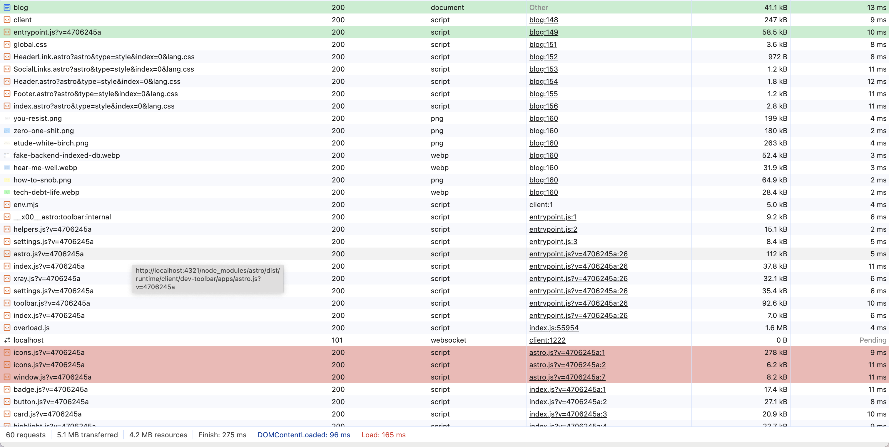
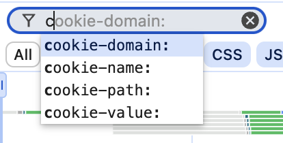
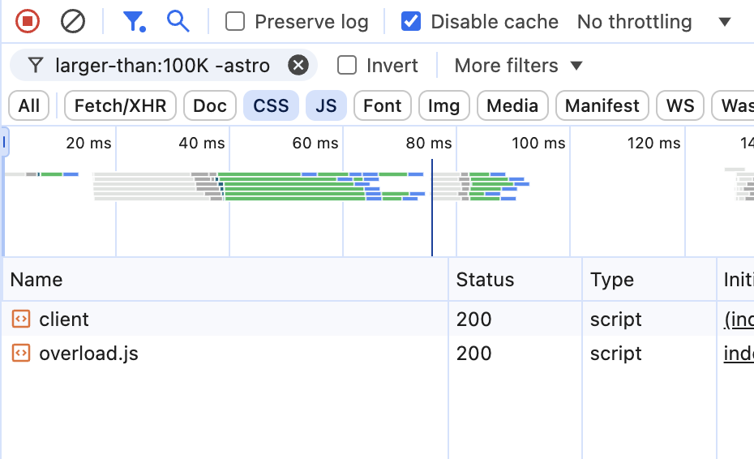
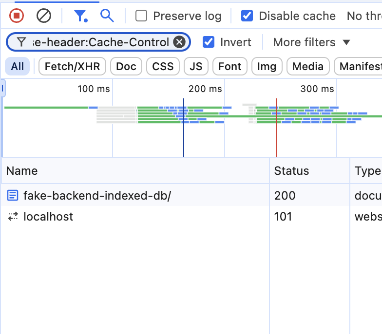
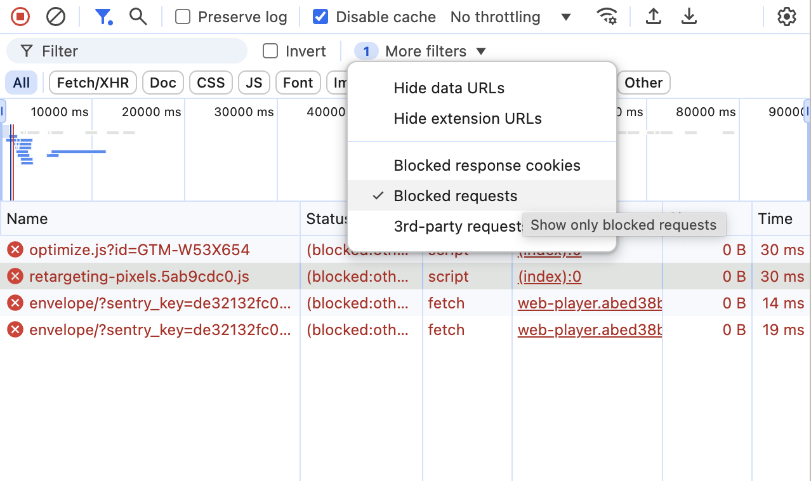

## Initiator

For every network resource, initiator data is logged. Click on a request you're interested in, and open the Initiator tab

It shows not only the file, line and column from where the request is initiated, but the whole stack trace. Leads you to the code listing on the Sources tab. Works best with sourcemaps or plain old non-minified js.

### Preview transitive initiators in the list

Hold Shift key and hover over a resource in the list. It will highlight red resources that were requested from the hovered resource, and highlight green resource that initiated loading of the one you hover.

Note that it also highlights transitive initiators recursively, meaning that it highlights green the resource that triggered loading of the hovered resource, the resource that loaded that resource, and so on. Same goes the other direction, but in red.

## Filter resources

In the top bar, where you filter resources by type: XHR, CSS, JS, etc., you can select several types simultaneously by holding Cmd/Ctrl

### Querying

Right above the resource type filters, is the querying text field. It supports regexps. I don't like regular expressions, and, if I'm being completely honest, don't understand them. But if you do, then, sure, go ahead and shine, you, mister clever.

By adding a `-` before a word, you filter out resources matching the word. Also, you can use special property names and they even have a basic intellisense:

To put it all together, this is how you filter CSS and JS files larger than 100kb _not_ having the word "astro" in URL:

`domain:framer.com`, `mime-type:application/json`, `method:put` and `has-response-header:X-Frame-Options` are all valid requests. For the full list of query params you can refer to [Chrome for developers](https://developer.chrome.com/docs/devtools/network/reference#filter-by-property). If you'd read it full, this post wouldn't be needed, but it's so comprehensive and boring that I believe you won't, and this post still makes sense.

### Invert filter

Shows only requests that are filtered out by current query. For example, type `has-response-header:Cache-Control` in the query field and enable the "Invert filter" option, and you'll get only resources that have no `Cache-Control` header.

### Show only blocked requests

Shows only resources that are blocked by extensions and by "Block request URL". Useful to find that one little shit mistakenly blocked by AdBlock and breaking your app.

There's more to learn

- Filtering by timeline
- Screenshots aka filmstrip
- Preserve log and pause recording
- Export/import
- Network throttling
- Blocking of request
- Custom user agent
- Override content
- Replay XHR

But for some other time.